# Mental Coaching Platform — Software Architecture Document

**Version:** 1.0 (design-time)
**Status:** For review before development
**Source of truth:** *Mental Coaching Platform — Product Specification v1.0* and *Beyond Movement — UI/UX Design Decisions*
**Team assumption:** 3 developers (1 mobile, 1 backend, 1 full-stack/flex)

---

## 0. Assumptions and Open Questions

Nothing below is invented product scope. These are gaps in the specification that a decision is needed on. Each is listed with the assumption the architecture currently makes so development is not blocked, and each should be confirmed by the client before build.

| # | Gap in specification | Working assumption | Impact if wrong |
|---|---|---|---|
| A-01 | Calendly **Standard** plan and webhook availability. The spec fixes Calendly Standard (BR-13) but webhook subscriptions on Calendly's API have historically required a paid tier whose exact entitlement changes. | Webhooks are available on the selected seat. A **polling reconciliation job** is built regardless, so the integration works either way. | If webhooks are unavailable, sync latency rises from seconds to the polling interval (5–15 min). Architecture already tolerates this. |
| A-02 | Session **duration** source. Reports require "total coaching hours" but no duration field is defined as coach-editable. | Duration comes from the Calendly event type and is stored on the session record; Admin may override it on Session Details. | Reporting hours would be wrong or non-reproducible. |
| A-03 | **Observation** sessions. BR-07 says an observation over one hour consumes one session, but observations are not booked through Calendly in the UI spec. | Observations are created manually by the Admin as a session record with type = Observation. Deduction is triggered by the same "Mark as Attended" action, and the >1h rule is evaluated from the recorded duration. | An entire creation flow (Create Observation) is missing from the screen catalogue. |
| A-04 | **No-show** default. Spec says configurable, default no deduction. | No-show is a session status that does not deduct. Configurability is a single system setting, not per-athlete. | Rework in the attendance service if per-athlete policy is wanted. |
| A-05 | **Partial payment** amounts. Payment status includes "Partially Paid" but no amount-paid field is specified. | Payment records store amount, currency (EGP), and status; partial = sum of payments < package price. | Financial reporting accuracy. |
| A-06 | **Timezone.** Reports use "the user's local timezone" but Calendly events arrive in UTC with an event timezone. | All timestamps stored in UTC; the Admin's profile timezone drives report bucketing; the app renders in device timezone. | Session counts land in the wrong week/month at boundaries. |
| A-07 | **Athlete deletion** semantics — "remove or anonymize". | Soft-delete with personal-data anonymization, retaining anonymized session/financial rows for report integrity. Hard purge is a separate, logged operation. | Legal/privacy exposure; irreversible data loss. |
| A-08 | **Admin booking on behalf of athlete** is marked "Optional" in the permission matrix. | Not built in v1. Admin uses Calendly directly if needed. | A screen and a permission path are missing. |
| A-09 | **Chat images** are "if feasible". | Storage, upload pipeline, and moderation-free direct upload are designed for images from day one; the client toggle is a feature flag. | None — designed in, cheap to enable. |
| A-10 | **Invitation expiry** is "configurable period". | Default 14 days, single-use, configurable by system setting. | Minor. |
| A-11 | **Whiteboard/notes link** is an external URL (the spec never says the app renders a whiteboard). | Stored as a validated external URL per athlete, opened in an in-app browser. Session notes are stored internally. | Large scope change if an in-app whiteboard is expected. |
| A-12 | **Data residency.** Client and users appear to be Egypt-based (InstaPay, EGP). | Hosting in an EU region for latency/compliance balance; no Egyptian residency requirement assumed. | Migration cost if residency is mandated. |
| A-13 | **Push to multiple devices** per user. | Device tokens are a one-to-many table per user; all active devices receive the push. | Missed notifications. |
| A-14 | **Voice note maximum length** is unspecified. | 5 minutes / 10 MB cap, AAC-encoded. | Storage cost and upload reliability. |
| A-15 | The UI spec's Admin Home shows a **Messages** quick action and a Conversation List; the spec's Athlete Dashboard shows unread counts. Real-time delivery expectations are not stated. | Near-real-time via WebSocket (SignalR) when the app is foregrounded, push notification otherwise. | Perceived product quality only. |

### 0.2 Source documents and how they were used

| Document | Role in this design |
|---|---|
| **Mental Coaching Platform — Product Specification v1.0** | Primary source of truth. All functional requirements, business rules (BR-01…BR-18), the permission matrix, the conceptual data model, the screen catalogue, integrations, and acceptance criteria are taken from it directly. |
| **Beyond Movement — UI/UX Design Decisions** | Implementation reference for screen behaviour. It is *more specific* than the spec in several places (exact statuses, exact card contents, navigation targets, persistence rules) and supplies the brand tokens the spec left as placeholders. Where it adds detail without contradicting the spec, the detail is treated as binding. |

The UI/UX document is explicitly incomplete — **Chat, Packages, Payments, and Settings screens are marked "To be completed."** The architecture therefore designs those modules from the specification's functional requirements and screen catalogue alone, and their UI behaviour must be reviewed again once those sections are written. No architectural rework is expected, but screen-level details (e.g. how partial payments are displayed) are still open.

### 0.3 Conflicts between the two documents

These are not gaps — they are places where the two sources disagree. Each needs a ruling, and the architecture states which side it currently implements.

| # | Conflict | Product Spec says | UI/UX doc says | Implemented as | Why |
|---|---|---|---|---|---|
| C-01 | **Payment status values** | Unpaid, Partially Paid, Paid (§4.9) | Paid, Pending (Athlete Profile) | The spec's three values are stored; the profile screen may render "Pending" as the label for both Unpaid and Partially Paid | Narrowing the stored set to two would make partial payments unrepresentable and break §4.9's acceptance criteria. Widening a label is free; widening a database enum later is a migration. |
| C-02 | **Manual session creation** | Admin may book "optional on behalf of athlete" (permission matrix) | Admin Home has a **New Session** quick action, but the Schedule screen states sessions are *not* manually created and the + button must be removed | No general manual booking in v1 (A-08). The **New Session** quick action is mapped to creating an **Observation** record (A-03), which is the one session type Calendly does not produce | This resolves both the internal contradiction in the UI doc and the missing Observation creation flow at once. Needs client confirmation. |
| C-03 | **Session statuses** | Scheduled, Attended, No-show, Cancelled (§4.6) | Scheduled, Attended, Cancelled (No-show absent) | All four stored; No-show is Admin-only and defaults to no deduction (A-04) | Dropping No-show would lose a status the spec requires for reporting. |
| C-04 | **Zero remaining sessions** | Notify athlete to renew (BR-09) | Display **"New sessions pending"** instead of "0 sessions remaining" | Balance stays `0` in the data model; the *presentation layer* substitutes the phrase | A display rule must never become a stored state — otherwise reports and deduction logic would have to special-case it. |
| C-05 | **Athlete list "Inactive"** | Uses Paused/Active for *account* status | Uses Active/Inactive for *package* status | Two independent concepts, per section 6.2 | Conflating them would let a pause silently hide package data, or a lapsed package silently block login. |
| C-06 | **Bottom navigation label** | Not specified | "Home" on most screens, "Dashboard" on the Schedule mockup | "Home" throughout | Cosmetic; flagged so it is fixed in design rather than shipped inconsistently. |
| C-07 | **Branding** | "Insert approved logo, colors, typography… this document uses placeholders only" (§7) | Supplies a complete, specific palette | The UI/UX palette is treated as approved | The later, more specific document wins. Confirm with the client that these are final. |

### 0.4 UI/UX decisions with direct architectural consequences

Five details in the UI/UX document are easy to read as pure styling but actually constrain the backend:

1. **"Last Session Note (1 line)" on Admin Home session cards.** The dashboard's upcoming-sessions list must join each athlete's *most recent* session note. Done naively this is an N+1 across every card. It is served instead by a single lateral-join query in the dashboard's Dapper statement (section 13.5), and the note is truncated server-side so the API never ships a 2,000-word note to render one line.
2. **Selecting an upcoming session on Admin Home opens the Athlete Profile**, while selecting a session on the Schedule screen opens Session Details. Same card, two destinations. The dashboard payload therefore carries `athleteId` *and* `sessionId`, and the two screens are separate routes rather than a shared component with a mode flag.
3. **Sort order persists across app restarts.** Because a coach may use more than one device, this is stored server-side in `Users.UiPreferences` and hydrated at login, not only in device preferences.
4. **"Session 7 out of 12" on Session Details.** A session must resolve its package position at display time. This is why `Sessions.PackageId` exists rather than deriving the link from dates — a session moved by a reschedule must keep its package association (section 8.4).
5. **Statistic cards "may become clickable in a future version" and the doc requests analytics drill-down.** The reports endpoints (section 14.8) are therefore designed to accept the same period filter as the dashboard and return the underlying records, so drill-down is a client change with no new backend work.

---

## 1. Executive Summary

### 1.1 What is being proposed

A **modular monolith backend built on ASP.NET Core**, exposing a versioned REST API plus one WebSocket channel for chat, backed by **PostgreSQL**, with a **Flutter** mobile client for both roles, and a small set of managed third-party services (Calendly, Firebase Cloud Messaging, a transactional email provider, S3-compatible object storage, Redis).

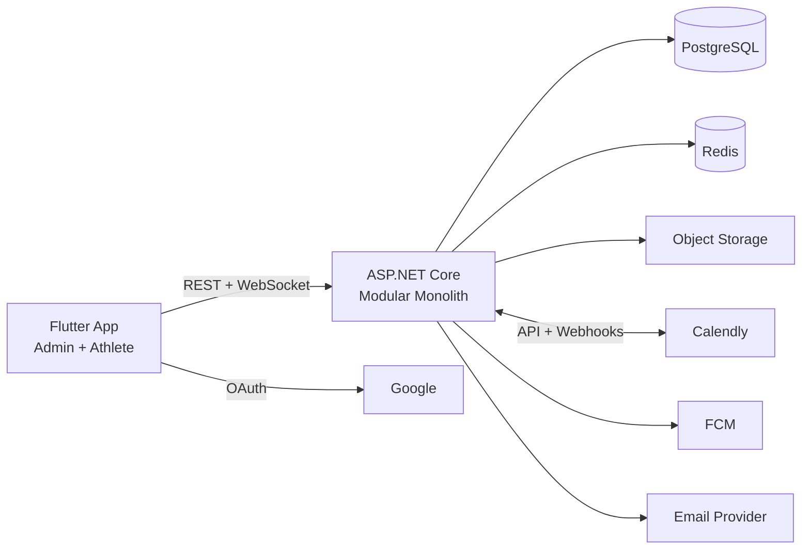

### 1.2 Why this architecture

The decision driver is not scale — it is **one coach, a few dozen athletes, three developers, and a fixed v1 scope**. The architecture optimises for delivery speed and long-term maintainability at small size, while leaving clean seams where the product roadmap (section 17) says growth will happen.

| Choice | Reason |
|---|---|
| **Modular monolith, not microservices** | The entire domain fits in one transactional boundary. Attendance must atomically update a session *and* a package balance (BR-05) — that is a single database transaction in a monolith and a distributed saga in microservices. Three developers cannot afford distributed operations. |
| **Modules with enforced boundaries** | The roadmap explicitly names multi-coach, organizations, and AI summaries. Module boundaries drawn now make later extraction mechanical instead of archaeological. |
| **PostgreSQL, single instance** | Relational data with strong invariants (one active package per athlete, exactly-once deduction). Postgres also covers JSON payload storage for webhooks and full-text search for athlete/message search without adding a second datastore. |
| **Flutter, single codebase** | Two roles, one app shell, one design system, one team member owning mobile. Flutter's rendering model makes the "premium, minimal, consistent" design in the UI document identical on both platforms without per-platform tuning. |
| **Calendly as source of truth for scheduling** | Mandated by BR-13. The architecture treats the local `Sessions` table as a **projection** of Calendly, never as the authority, with reconciliation to repair drift. |
| **Manual payment confirmation** | No PCI scope. The platform never touches card data or InstaPay credentials — it stores a payment *assertion* made by the Admin. This removes an entire class of compliance and security work from v1. |

### 1.3 The three architectural risks that shape everything

1. **Calendly is an external dependency on the critical path.** Mitigated by projection + reconciliation + graceful degradation (section 8).
2. **Exactly-once session deduction** is the single most important business invariant in the product (BR-04, BR-05, acceptance checklist). It is protected at the database level, not by application discipline alone (section 6.6).
3. **Single-tenant assumptions leaking into the schema.** Mitigated by carrying a `CoachId` on every owned entity from day one, even though it is always the same value in v1 (section 17.1).

---

## 2. High-Level Architecture

### 2.1 System context

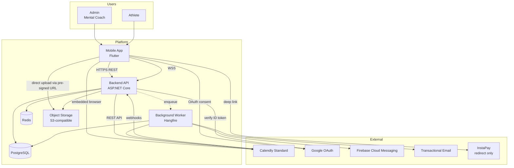

Note two deliberate arrows:

- **The app uploads files directly to object storage**, not through the API. The API only issues short-lived pre-signed URLs. This keeps voice notes and images off the API's bandwidth and memory.
- **The app opens InstaPay and Calendly directly.** The backend never proxies them. It only receives the *result* (a webhook from Calendly, an Admin confirmation for payment).

### 2.2 Container view

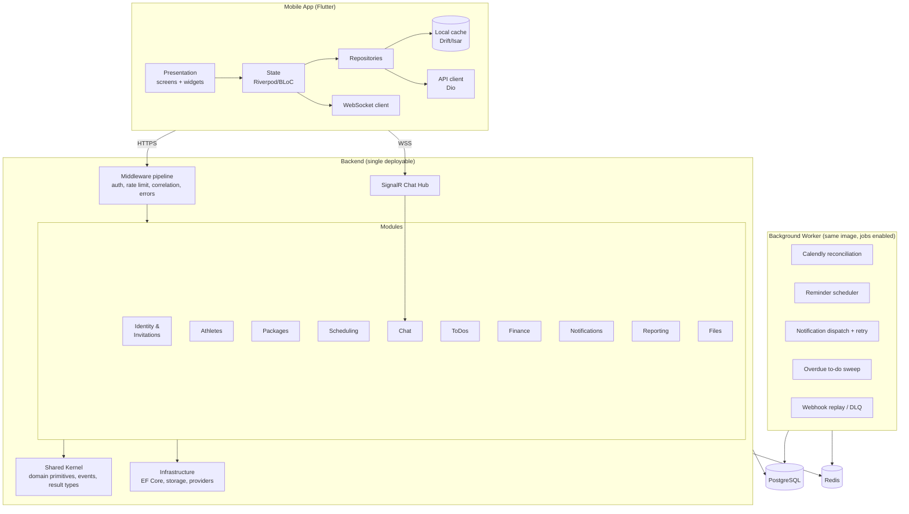

**Deployment shape:** one container image, two deployments — the API instance(s) and one worker instance with the job scheduler enabled. Same code, different startup flag. This avoids a second codebase while keeping long-running work off request threads.

### 2.3 Request flow: the three shapes

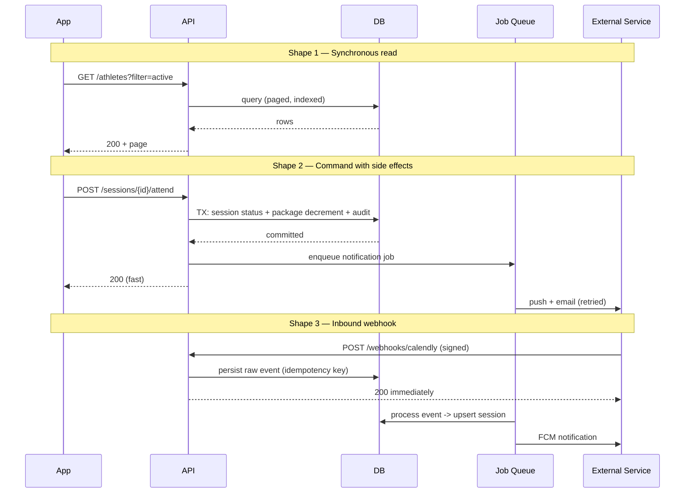

The rule: **the API acknowledges fast and does slow, failure-prone work in the background.** No request thread ever waits on FCM, an email provider, or Calendly.

---

## 3. Technology Stack

| Layer | Recommendation | Why | Alternatives rejected |
|---|---|---|---|
| **Mobile frontend** | Flutter 3.x (Dart) | One codebase, pixel-identical rendering on iOS/Android, excellent for a design-led UI with custom components. One developer can own the whole client. | React Native — viable, but pushes the team toward JS on both ends without a JS backend, and needs more per-platform styling work. |
| **Backend** | ASP.NET Core 8 LTS (C#) | Strong typing and a mature background-job/ORM/auth ecosystem; a single language reduces context switching for a 3-person team; excellent long-term support window. | Node/NestJS (weaker compile-time guarantees for financial invariants); Django (weaker real-time story). |
| **API style** | REST + JSON, `/api/v1`; SignalR (WebSocket) for chat only | REST is trivially cacheable, debuggable, and mobile-friendly. A second protocol only where it earns its keep. | GraphQL — over-engineered for a client this well-known; adds N+1 and caching complexity. |
| **Authentication** | ASP.NET Core Identity + JWT access token + rotating refresh token; Google via ID-token verification | Identity provides password hashing, lockout, and reset tokens for free. Self-hosted avoids a per-user IdP bill at this scale. | Auth0/Firebase Auth — faster start, but invitation-only + paused-account rules are custom logic that would live half in the IdP and half in the app. |
| **Database** | PostgreSQL 16 (managed) | Transactional integrity for package deduction; JSONB for raw webhook payloads; `tsvector` for search; partial unique indexes to enforce "one active package". | MySQL (weaker JSON/partial index support); MongoDB (wrong shape for financial invariants). |
| **ORM** | EF Core 8, code-first migrations; Dapper for reporting queries | EF for command-side correctness and change tracking; raw SQL via Dapper for the aggregate-heavy dashboard, where EF generates poor plans. | EF-only (slow reports); Dapper-only (hand-written migrations and mapping). |
| **Storage** | S3-compatible object storage (AWS S3 or Cloudflare R2) with pre-signed PUT/GET | Direct client upload/download, no API bandwidth cost, per-object access control. R2 has zero egress, which matters for voice-note playback. | Storing files in Postgres — bloats backups, kills restore times. |
| **Caching** | Redis (managed) | Dashboard aggregates, refresh-token denylist, rate-limit counters, SignalR backplane when scaled to >1 instance. | In-memory only — breaks the moment a second instance exists. |
| **Background jobs** | Hangfire with PostgreSQL storage | Persistent, retriable, has a dashboard the team can actually look at during incidents; no extra infrastructure. | Quartz.NET (no built-in retry UX); Azure Functions (splits the codebase). |
| **Push notifications** | Firebase Cloud Messaging | Free, covers both platforms, integrates cleanly with Flutter. APNs is reached through FCM. | OneSignal — fine, but another vendor for no gain. |
| **Email** | Postmark (or SendGrid/Resend) for transactional | High deliverability for invitations and password resets — an undelivered invitation blocks onboarding entirely (BR-01). | Self-hosted SMTP — deliverability risk not worth it. |
| **Hosting** | Containers on a managed platform: Azure Container Apps *or* AWS ECS Fargate *or* DigitalOcean App Platform | All three run the same image. Recommend **Azure Container Apps** for .NET tooling affinity, or **DigitalOcean** if cost dominates. | Kubernetes — operationally far too heavy for three developers. |
| **Logging** | Serilog → structured JSON → provider log sink (Application Insights / Seq) | Correlation IDs across API → job → webhook are the only way to debug the Calendly path. | `ILogger` to console only — unqueryable. |
| **Monitoring** | OpenTelemetry traces + provider APM; Sentry for mobile crashes; uptime check on `/health` | Mobile crash visibility is separate from server health and both are needed. | None — unacceptable for a payment-adjacent product. |
| **CI/CD** | GitHub Actions (backend: build → test → migrate → deploy); Codemagic or Fastlane (mobile: build → TestFlight/Play Internal) | Standard, cheap, well documented. | Manual builds. |
| **Secrets** | Cloud-native secret store (Azure Key Vault / AWS Secrets Manager) injected as environment variables; `dotnet user-secrets` locally | Secrets never enter Git or the image. | `.env` in the repo. |
| **Analytics** | Firebase Analytics for product usage; **all business reporting from own PostgreSQL** | Section 4.12 reports must be "reproducible from underlying records" — they must not come from an analytics vendor. | Mixpanel for business reporting. |
| **Feature flags** | Simple DB-backed settings table | Covers A-09 (chat images) and A-04 (no-show policy) without a vendor. | LaunchDarkly — overkill. |

---

## 4. Mobile Architecture

### 4.1 Framework: Flutter

**Recommended: Flutter.** Reasoning specific to this product:

- The UI/UX document specifies a tight custom design language (fixed palette, rounded corners, soft shadows, consistent cards). Flutter renders its own widgets, so this is identical on both platforms with no per-OS divergence.
- Two roles share ~60% of screens (chat, session details, package view, profile, notifications). One widget library serves both.
- Voice recording, background push, and in-app browser (for Calendly and InstaPay) all have mature, well-maintained plugins.
- One developer can realistically own iOS + Android + shared logic.

Trade-off accepted: a slightly larger binary and less native "feel" than React Native's native components. For a private, invitation-only app with a custom design system, this is irrelevant.

### 4.1b Design tokens (from the UI/UX document)

The UI/UX document supplies a complete palette, so the theme is defined once as tokens and never as inline colours. This is what makes "reuse components" and "clean and minimal" enforceable rather than aspirational.

| Token | Value | Used for |
|---|---|---|
| `primary` | `#3E4DA1` | Headings, selected nav, primary buttons, active filter chip |
| `secondary` | `#D5EFFA` | Time blocks on session cards, secondary button fills |
| `accent` | `#FDF6B0` | Avatar backgrounds, subtle highlights |
| `notification` | `#D86ED7` | Badges, unread indicators, alert emphasis |
| `surface` | `#FFFFFF` | Background — white, per the design principles |

Structural tokens: rounded corners, soft shadows, and generous whitespace are expressed as `AppRadius`, `AppShadow`, and `AppSpacing` scales in `app/theme/`. Semantic status colours (Active / Done / Paid / Pending) are separate tokens, not reuses of the brand palette, so a rebrand does not silently change the meaning of a badge.

A shared widget set in `shared/widgets/` covers the components the UI document reuses across screens: `AppCard`, `StatCard`, `SessionCard`, `AthleteCard`, `StatusBadge`, `FilterChipRow`, `SectionHeader`, `EmptyState`, `PrimaryButton`. Both role shells consume the same set.

### 4.2 State management

**Riverpod** (with `AsyncNotifier`) as the primary approach.

| Concern | Approach |
|---|---|
| Server state (lists, profiles, packages) | `AsyncNotifier` per feature, exposing `AsyncValue<T>` → maps directly to loading / empty / error / data states required by spec §7 |
| Ephemeral UI state (filter chips, expanded cards) | Local `StatefulWidget` state; not lifted |
| Persistent user preference (athlete list sort order — UI doc requires it survive app restart) | Written to secure/shared preferences, hydrated at startup via a `SettingsNotifier` |
| Session/auth state | A single `AuthNotifier` at the root; role and paused-status changes drive navigation redirects |
| Chat stream | A `StreamNotifier` bound to the SignalR connection, merged with the local message cache |

Why not BLoC: it is equally valid, but Riverpod's compile-time safety and lack of boilerplate suits a small team better. **Either is acceptable — the important rule is one pattern, chosen once.**

### 4.3 Folder structure

```
lib/
├── main.dart
├── app/
│   ├── app.dart                    # root widget, theme, router wiring
│   ├── router.dart                 # GoRouter config + guards
│   ├── theme/                      # colors, typography, spacing, shadows
│   └── di.dart                     # provider overrides / composition root
├── core/
│   ├── network/                    # Dio client, interceptors, retry
│   ├── auth/                       # token store, refresh logic
│   ├── storage/                    # secure storage, local DB setup
│   ├── errors/                     # Failure types, exception mapping
│   ├── result/                     # Result<T, Failure>
│   ├── realtime/                   # SignalR connection manager
│   └── utils/                      # formatters, validators, date helpers
├── features/
│   ├── auth/
│   │   ├── data/                   # DTOs, remote + local data sources, repo impl
│   │   ├── domain/                 # entities, repository interface, use cases
│   │   └── presentation/           # screens, widgets, notifiers
│   ├── admin_dashboard/
│   ├── athlete_dashboard/
│   ├── athletes/
│   ├── packages/
│   ├── schedule/
│   ├── sessions/
│   ├── chat/
│   ├── todos/
│   ├── payments/
│   ├── expenses/
│   ├── notifications/
│   ├── reports/
│   └── profile/
└── shared/
    ├── widgets/                    # AppCard, StatusBadge, EmptyState, ...
    ├── models/
    └── extensions/
```

Rule: **features never import from other features.** Cross-feature needs go through `shared/` or `core/`. This mirrors the backend's module boundaries, so a change like "add package expiry warning to the athlete card" touches one folder on each side.

### 4.4 Navigation

**GoRouter**, declarative, with a role-aware redirect guard.

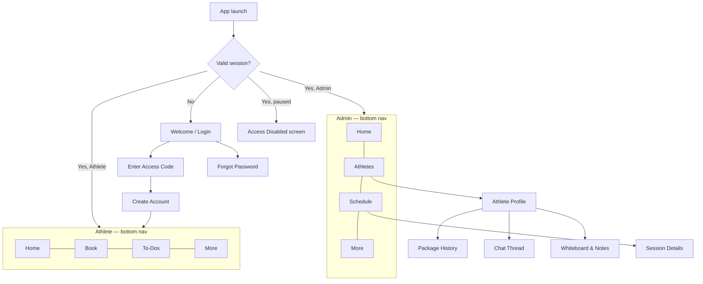

- **Deep links** are required: push notifications must open the correct screen (spec §4.10 acceptance criteria). Every notification carries a `destination` route string that maps to a GoRouter path.
- Two shells, never one shell with conditional tabs — role is decided once at the top.

### 4.5 Dependency injection

Riverpod providers **are** the DI container. A single composition root (`app/di.dart`) overrides infrastructure providers per environment.

```
Provider<Dio>                 → configured per flavor (dev/staging/prod base URL)
Provider<AuthRepository>      → implementation backed by ApiAuthDataSource
Provider<AthleteRepository>   → ...
```

Every repository is defined as an interface in `domain/` and provided as an implementation. Tests override providers with fakes; no mocking framework gymnastics required.

### 4.6 Offline strategy

The product is not offline-first — it is **offline-tolerant**. Full offline sync is not in scope and would be an expensive mistake at v1.

| Data | Behaviour offline |
|---|---|
| Athlete list, athlete profile, packages, schedule | Cached locally (Drift/Isar), shown immediately as stale, refreshed on reconnect. Screens show a subtle "last updated" affordance instead of blocking. |
| Chat history | Cached locally; the last N messages per conversation are always readable offline. |
| Outbound chat messages | Queued with a local `pending` state and a client-generated message ID; sent on reconnect; deduplicated server-side by that ID. Shown with a clock icon until acknowledged. |
| Marking a session attended | **Never queued.** This mutates package balance and must be online-only, because the server enforces exactly-once semantics. The button is disabled with a clear "You're offline" message. |
| Booking a session | Online-only — it is a Calendly web flow. |
| To-do completion | Queued and replayed; idempotent server-side (setting completed twice is harmless). |
| Payment status change | Online-only — financial state must not be optimistically applied. |

The rule that governs the table: **queue actions that are idempotent and non-financial; block actions that consume a resource.**

### 4.7 Image uploads

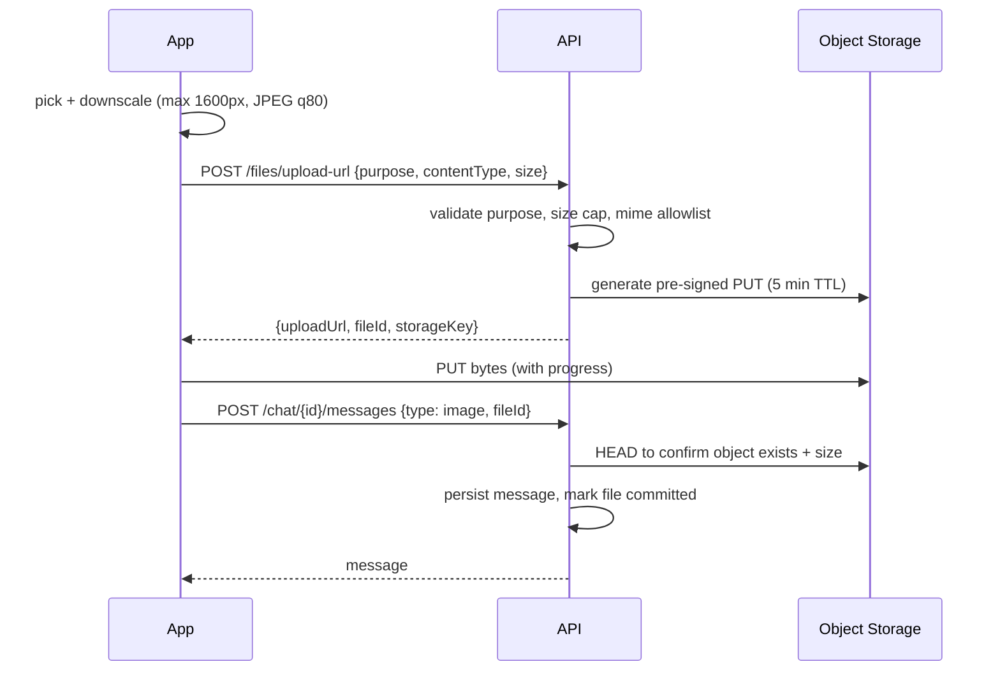

Key points: client-side downscaling before upload (bandwidth in the target market matters); the API validates *intent* before issuing a URL and *existence* before committing; orphaned uploads (URL issued, never committed) are swept by a nightly job.

### 4.8 Voice notes

- Record to AAC/M4A, mono, 32–64 kbps — an order of magnitude smaller than WAV, indistinguishable for speech.
- Cap at 5 minutes (A-14) with a visible countdown; hard-stop at the limit rather than failing at upload.
- Same pre-signed upload pipeline as images, with `purpose: voice_note`.
- Waveform amplitude samples are captured during recording and stored as a small array on the message so the receiver renders a waveform without downloading the audio.
- Playback streams via a pre-signed GET; the file is cached locally after first play.
- Recording requires a runtime microphone permission with a graceful denial path.

### 4.9 Error handling

Three layers, each with one job:

1. **Network layer (Dio interceptors).** Attaches auth token and correlation ID; on `401` attempts a single refresh then retries once; on `403 ACCOUNT_PAUSED` clears the session and routes to the Access Disabled screen; retries idempotent GETs on transient failure with exponential backoff.
2. **Repository layer.** Converts exceptions to a typed `Failure` (`NetworkFailure`, `AuthFailure`, `ValidationFailure`, `ServerFailure`, `NotFoundFailure`) and returns `Result<T, Failure>`. No exception crosses into presentation.
3. **Presentation layer.** `AsyncValue.when(...)` renders the four states mandated by spec §7 — loading indicator, empty state with a next action, plain-language error with retry, and data. Technical details are never shown; the correlation ID is displayed in small text on the error state so support can trace it.

A global `FlutterError.onError` + `runZonedGuarded` hook reports uncaught errors to Sentry with the current route and user ID (never message content).

---

## 5. Backend Architecture

### 5.1 The recommendation and why

**Modular Monolith, organised internally by Vertical Slices, with Clean Architecture layering applied only where domain complexity justifies it.**

That sentence contains three decisions. Taken separately:

**Modular Monolith — yes.**
The strongest argument is transactional. BR-04/BR-05 require that marking a session attended updates the session status and decrements the package balance, exactly once. In a monolith this is `BEGIN … COMMIT`. Split Scheduling and Packages into services and it becomes a saga with compensating transactions — a large amount of work and a new class of bugs, in exchange for scaling headroom that a single coach will never need. Deployment, local development, and debugging are all dramatically simpler for three people.

**Vertical Slice organisation — yes, as the default.**
Most of this system is CRUD with rules attached: create a to-do, record an expense, list athletes, update payment status. Forcing every one of these through repository → service → controller layers produces four files and two interfaces to add a field. Vertical slices put the request, validation, handler, and response for one use case in one place, so a feature change is a one-folder change.

**Clean Architecture layering — yes, but selectively.**
Two areas have real domain logic worth protecting behind a domain model: **Packages/Attendance** (the deduction invariant) and **Scheduling** (state transitions between Scheduled/Attended/Cancelled/No-show, and the Calendly projection). These get proper domain entities with behaviour and no EF Core dependency in the domain layer. Chat, To-Dos, Expenses, and Notifications do not need this ceremony and use thin slices straight to EF Core.

This is a deliberate, documented asymmetry. Uniform layering everywhere is a common failure mode: it makes the simple 80% expensive without making the complex 20% safer.

**Why not microservices:** stated above — no scaling need, no team-boundary need (3 devs), high operational cost, and it breaks the core invariant's transaction.

### 5.2 Module map and allowed dependencies

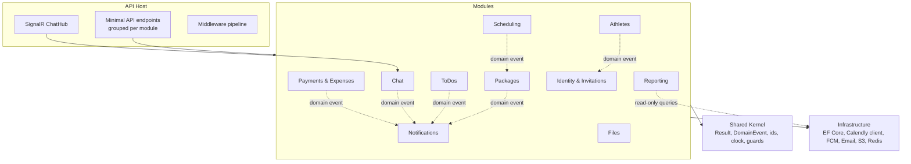

**Rules enforced in code review and by architecture tests (NetArchTest):**

- A module may not reference another module's internal types. Cross-module communication is by **in-process domain events** (MediatR notifications) or by a narrow published contract interface.
- `Notifications` is a pure consumer — nothing depends on it, so its failure never blocks a business operation.
- `Reporting` is read-only and may query across module tables directly (it is a read model, deliberately exempt from the boundary rule; enforcing it here would mean building a separate projection store for no benefit at this scale).
- The domain layer of `Packages` and `Scheduling` references nothing outside the shared kernel — no EF Core, no HTTP, no logging.

### 5.3 Backend folder structure

```
src/
├── MentalCoaching.Api/                    # host, composition root
│   ├── Program.cs
│   ├── Endpoints/                         # per-module endpoint groups
│   ├── Middleware/                        # exception handler, correlation, paused-check
│   ├── Hubs/ChatHub.cs
│   ├── Filters/                           # validation filter, idempotency filter
│   └── Configuration/                     # options binding, DI extensions
│
├── MentalCoaching.Modules.Identity/
│   ├── Features/
│   │   ├── Login/                         # Command, Validator, Handler, Response
│   │   ├── RefreshToken/
│   │   ├── GoogleSignIn/
│   │   ├── CreateInvitation/
│   │   ├── RedeemInvitation/
│   │   ├── RequestPasswordReset/
│   │   ├── ResetPassword/
│   │   └── PauseAthleteAccess/
│   ├── Domain/                            # User, Invitation, RefreshToken
│   ├── Persistence/                       # EF configs
│   └── Contracts/                         # published interface + events
│
├── MentalCoaching.Modules.Packages/       # richest domain model
│   ├── Domain/
│   │   ├── Package.cs                     # behaviour: Consume(), Close(), CanActivate()
│   │   ├── PackageStatus.cs
│   │   └── Events/                        # OneSessionRemaining, PackageDepleted
│   ├── Application/                       # use cases
│   ├── Features/
│   └── Persistence/
│
├── MentalCoaching.Modules.Scheduling/
│   ├── Domain/                            # Session aggregate, status transitions
│   ├── Features/                          # MarkAttended, MarkNoShow, ListSessions, ...
│   ├── Calendly/                          # webhook handlers, event mapper, reconciler
│   └── Persistence/
│
├── MentalCoaching.Modules.Athletes/
├── MentalCoaching.Modules.Chat/
├── MentalCoaching.Modules.ToDos/
├── MentalCoaching.Modules.Finance/
├── MentalCoaching.Modules.Notifications/
├── MentalCoaching.Modules.Reporting/
├── MentalCoaching.Modules.Files/
│
├── MentalCoaching.SharedKernel/           # Result<T>, Error, IDomainEvent, IClock, ids
├── MentalCoaching.Infrastructure/         # DbContext, migrations, external clients
└── MentalCoaching.Worker/                 # Hangfire job definitions + schedules

tests/
├── MentalCoaching.UnitTests/              # domain rules, especially deduction
├── MentalCoaching.IntegrationTests/       # Testcontainers Postgres, real EF
├── MentalCoaching.ArchitectureTests/      # module boundary enforcement
└── MentalCoaching.ContractTests/          # Calendly webhook payload fixtures
```

### 5.4 Dependency injection

- Built-in `Microsoft.Extensions.DependencyInjection`.
- Each module exposes `AddIdentityModule(IConfiguration)` etc.; `Program.cs` calls them in sequence. Adding a module is one line.
- Lifetimes: `Scoped` for DbContext, repositories, and handlers; `Singleton` for clients with connection pooling (HTTP clients via `IHttpClientFactory`, Redis multiplexer), config options, and `IClock`; `Transient` for validators and lightweight mappers.
- `IClock` abstraction everywhere — no `DateTime.UtcNow` in domain code. Overdue-to-do and reminder logic is untestable otherwise.
- Options pattern with `ValidateOnStart()` so a missing Calendly token fails at boot, not at 2 a.m. on the first webhook.

### 5.5 Background jobs

Hangfire, PostgreSQL-backed, dashboard secured behind Admin-only auth.

| Job | Trigger | Purpose | Failure policy |
|---|---|---|---|
| `ProcessCalendlyWebhook` | Enqueued on receipt | Map raw event → session upsert | 5 retries, exponential backoff, then dead-letter table + Admin alert |
| `ReconcileCalendlyEvents` | Every 15 min | Pull scheduled events for a rolling window; repair drift and cover missed webhooks | Logged; alerts after 3 consecutive failures |
| `DispatchNotification` | Enqueued on domain event | Send push + email | Per-channel retry (section 10.6) |
| `ScheduleSessionReminders` | Hourly | Enqueue 24h and 1h reminders for upcoming sessions | Idempotent by (sessionId, reminderType) |
| `SweepOverdueToDos` | Daily 00:15 local | Move Pending → Overdue past due date; notify | Idempotent |
| `PackageBalanceAlerts` | On domain event + daily safety sweep | One-remaining and zero-remaining notifications (BR-08, BR-09) | Idempotent by (packageId, alertType) |
| `CleanOrphanedUploads` | Nightly | Delete storage objects with issued-but-uncommitted file records >24h | Best effort |
| `PurgeExpiredTokens` | Nightly | Refresh tokens, password reset tokens, expired invitations | Best effort |

Every notification-producing job writes an outbox/dedup row **before** dispatch, keyed on the business event, so a retried job never double-notifies (spec §4.10: duplicates should be avoided).

### 5.6 Validation

Three tiers, deliberately distinct:

1. **Request validation** — FluentValidation, executed by an endpoint filter before the handler runs. Shape, required fields, formats, ranges. Returns `400` with a field-keyed error map that the mobile client renders inline.
2. **Business rule validation** — inside the domain/handler. "This athlete already has an active package" (BR-03), "this session is already attended", "this invitation is expired". Returns `409 Conflict` or `422` with a stable machine-readable error code, never a raw exception message.
3. **Database invariants** — the last line of defence, as constraints (section 6.6). If tiers 1 and 2 are bypassed by a bug, the database still refuses.

The distinction matters: a client can fix a tier-1 error by changing input; it cannot fix a tier-2 error by retrying. The mobile app treats them differently.

### 5.7 Error handling

- A single exception-handling middleware converts everything to **RFC 7807 Problem Details** with an added `errorCode` and `correlationId`.
- Domain code returns `Result<T>` rather than throwing for expected failures; exceptions are reserved for genuinely exceptional conditions.
- Stack traces and provider messages are logged, never returned (spec §7: do not expose technical details).
- Stable error codes are a contract: `INVITATION_EXPIRED`, `ACCOUNT_PAUSED`, `ACTIVE_PACKAGE_EXISTS`, `SESSION_ALREADY_ATTENDED`, `NO_SESSIONS_REMAINING`, `CALENDLY_UNAVAILABLE`. The mobile app switches on these to render the right message and action.

### 5.8 Logging

- Serilog, structured JSON, enriched with `CorrelationId`, `UserId`, `Role`, `Module`, `Environment`.
- Correlation ID originates on the mobile client, flows through HTTP headers into Hangfire job arguments, so a push notification failure can be traced back to the session that caused it.
- **Levels:** `Debug` (dev only), `Information` (business events: attendance marked, package created, invitation redeemed), `Warning` (retried external calls, validation storms), `Error` (job exhausted retries, webhook signature failures), `Fatal` (startup failure).
- **Never logged:** passwords, tokens, refresh tokens, chat message content, voice note contents, full email addresses in bodies (hashed or partially masked).
- Audit-worthy actions go to the `AuditLogs` table, not just to logs — logs rotate, audits must not (section 12.8).

---

## 6. Database Design

### 6.1 Entity relationship diagram

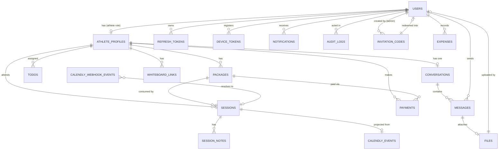

### 6.2 Core entities

**Users** — the single identity table for both roles.
`Id (uuid) · Role (Admin|Athlete) · Email (unique, citext) · PasswordHash (nullable — null for Google-only) · GoogleSubjectId (nullable, unique) · FullName · Phone · PhotoFileId · Status (Active|Paused|Deleted) · TimeZone · NotificationPreferences (jsonb) · **UiPreferences (jsonb)** · EmailVerifiedAt · LastLoginAt · CoachId · CreatedAt · UpdatedAt`

`CoachId` is present from day one and always the single admin's ID in v1. This is the cheapest possible investment in the multi-coach future (section 17.1).

`UiPreferences` holds the athlete-list **sort order**, which the UI/UX document requires to persist after the app is closed. It belongs to the *coach* (the person doing the sorting), not to the athlete being sorted — a distinction easy to get wrong, and one that would otherwise be discovered only when the preference behaved oddly.

**AthleteProfiles** — athlete-specific data, one-to-one with a User of role Athlete.
`Id · UserId (unique) · Sport · Gender · DateOfBirth · CoachId · Notes · CreatedAt · UpdatedAt · DeletedAt · AnonymizedAt`

Kept separate from Users because the Admin has none of these fields, and because A-07's anonymization can null this table's personal fields while leaving `Users` intact for referential integrity.

**There is deliberately no `IsActive` column here.** The UI/UX document's athlete-list filter (All / Active / Inactive) defines *Inactive* as "an athlete without an active package" — which is **not** the same as the specification's *Paused* account status. Storing both as one flag would silently merge two unrelated concepts. Therefore:

| Concept | Source | Meaning | Where it lives |
|---|---|---|---|
| **Paused** | Product Spec (BR-10, BR-11) | Account access is blocked; athlete cannot log in | `Users.Status` — a stored value |
| **Active / Inactive** | UI/UX doc, Athlete List + Athlete Profile header | Athlete does or does not currently hold an active package | **Derived** from `EXISTS(Packages WHERE Status='Active')` — never stored |

A paused athlete may still hold an active package, and an unpaused athlete may have none. The athlete-list query computes the Active/Inactive badge from the package join; the pause state is a separate field the Admin sees on the profile.

**Packages**
`Id · AthleteProfileId · Name · TotalSessions · UsedSessions · Price · Currency · StartDate · EndDate (nullable) · Status (Active|Completed|Closed) · PaymentStatus (Unpaid|PartiallyPaid|Paid) · Notes · CreatedAt · UpdatedAt · RowVersion`

`RemainingSessions` is **computed** (`TotalSessions − UsedSessions`), never stored, so it cannot drift. `RowVersion` provides optimistic concurrency on the deduction path.

**Sessions**
`Id · AthleteProfileId · PackageId (nullable) · CalendlyEventUri (unique, nullable) · ScheduledStartUtc · ScheduledEndUtc · DurationMinutes · DeliveryType (Online|FaceToFace|Observation) · Status (Scheduled|Attended|Cancelled|NoShow) · LocationOrPlatform · MeetingUrl · AttendedAt · AttendedByUserId · ConsumedSessionCount (0 or 1) · CancelledAt · CancellationReason · CreatedAt · UpdatedAt · RowVersion`

`ConsumedSessionCount` is the anchor of exactly-once deduction: it records what this session actually took, so the operation is verifiable and reversible. Observations under one hour record `0` (BR-07). `PackageId` is nullable because a session can exist before or after a package window.

**SessionNotes** — coach notes per session, feeding the Whiteboard & Notes history.
`Id · SessionId · AuthorUserId · Content · CreatedAt · UpdatedAt`

**Payments**
`Id · AthleteProfileId · PackageId · Amount · Currency · Status (Pending|Confirmed) · Method (InstaPay|Cash|Other) · PaidOn · ConfirmedByUserId · ConfirmedAt · ConfirmationNote · CreatedAt`

Payments are append-only records of Admin assertions; package `PaymentStatus` is derived from the sum of confirmed payments versus price.

**Expenses**
`Id · CoachId · Amount · Currency · Category · IncurredOn · Note · ReceiptFileId (nullable) · CreatedAt · UpdatedAt`

**ToDos**
`Id · AthleteProfileId · CreatedByUserId · Title · Description · DueDate · Priority (Low|Medium|High) · Status (Pending|Completed|Overdue|Archived) · CompletedAt · CompletedByUserId · CreatedAt · UpdatedAt`

`CompletedByUserId` exists to enforce and evidence the UI rule that the Admin never completes on the athlete's behalf.

**Conversations**
`Id · CoachId · AthleteProfileId · LastMessageAt · AdminUnreadCount · AthleteUnreadCount · CreatedAt`
Unique on `(CoachId, AthleteProfileId)` — one thread per athlete (BR-16). Denormalised unread counters avoid a `COUNT(*)` on every conversation-list render.

**Messages**
`Id · ConversationId · SenderUserId · ClientMessageId (for dedup) · Type (Text|Voice|Image) · Content (nullable) · FileId (nullable) · DurationSeconds (voice) · WaveformData (jsonb, voice) · SentAt · DeliveredAt · ReadAt · CreatedAt`

**Notifications**
`Id · UserId · Type · Title · Body · DestinationRoute · Payload (jsonb) · IsRead · ReadAt · PushStatus · EmailStatus · DedupKey (unique) · CreatedAt`
`DedupKey` is the mechanism behind "duplicate notifications should be avoided".

**InvitationCodes**
`Id · Code (unique, hashed) · Email · CoachId · CreatedByUserId · Status (Pending|Redeemed|Expired|Revoked) · ExpiresAt · RedeemedAt · RedeemedByUserId · CreatedAt`

**WhiteboardLinks**
`Id · AthleteProfileId · Label · Url · IsPrimary · CreatedByUserId · CreatedAt · UpdatedAt`
A table rather than a column on the athlete, because the UI describes a "shared working area" that may hold more than one link, and because a URL history is useful. Only one `IsPrimary` per athlete.

**Files**
`Id · UploaderUserId · Purpose (ProfilePhoto|VoiceNote|ChatImage|Receipt) · StorageKey · ContentType · SizeBytes · Status (Pending|Committed) · CreatedAt · CommittedAt`

**AuditLogs**
`Id · ActorUserId · ActorRole · Action · EntityType · EntityId · BeforeState (jsonb) · AfterState (jsonb) · CorrelationId · IpAddress · CreatedAt`
Append-only; no update or delete permission granted to the application role.

**Supporting tables:** `RefreshTokens`, `DeviceTokens`, `PasswordResetTokens`, `CalendlyWebhookEvents` (raw payload, signature, idempotency key, processing status), `SystemSettings` (feature flags, no-show policy, invitation TTL).

### 6.3 Key relationships in words

- One `User` ↔ zero-or-one `AthleteProfile`; the Admin has none.
- One `AthleteProfile` → many `Packages`, but **at most one with `Status = Active`** (BR-03).
- One `Package` → many `Sessions`, but a `Session` deducts from a package at most once.
- One `AthleteProfile` → exactly one `Conversation` with the coach.
- One `Session` → many `SessionNotes`; notes aggregate into the athlete's Whiteboard & Notes history.
- `CalendlyWebhookEvents` is a landing zone, not a relationship — events are stored raw first, resolved to sessions second.

### 6.4 Enumerations (single source of truth)

| Enum | Values |
|---|---|
| `UserRole` | Admin, Athlete |
| `UserStatus` | Active, Paused, Deleted |
| `PackageStatus` | Active, Completed, Closed |
| `PaymentStatus` | Unpaid, PartiallyPaid, Paid — see conflict C-01; the profile screen may label the first two as "Pending" |
| `SessionStatus` | Scheduled, Attended, Cancelled, NoShow |
| `DeliveryType` | Online, FaceToFace, Observation |
| `ToDoPriority` | Low, Medium, High |
| `ToDoStatus` | Pending, Completed, Overdue, Archived |
| `MessageType` | Text, Voice, Image |

Stored as strings, not integers — readable in the database during support, and immune to reordering mistakes.

### 6.5 Indexing plan

| Table | Index | Serves |
|---|---|---|
| Users | unique(Email), unique(GoogleSubjectId), (CoachId, Role, Status) | login, athlete list |
| AthleteProfiles | (CoachId, DeletedAt), GIN on name trigram | list, search by name |
| Packages | **partial unique (AthleteProfileId) WHERE Status='Active'** | BR-03 enforcement |
| Sessions | (AthleteProfileId, ScheduledStartUtc), (CoachId, ScheduledStartUtc, Status), unique(CalendlyEventUri) | schedule screen, dashboard, webhook resolution |
| Messages | (ConversationId, SentAt DESC), unique(ConversationId, ClientMessageId) | pagination, dedup |
| Notifications | (UserId, IsRead, CreatedAt DESC), unique(DedupKey) | notification centre, dedup |
| ToDos | (AthleteProfileId, Status, DueDate) | list + overdue sweep |
| Payments | (AthleteProfileId, PackageId), (CoachId, PaidOn) | reports |
| Expenses | (CoachId, IncurredOn) | reports |
| AuditLogs | (EntityType, EntityId, CreatedAt DESC), (CorrelationId) | investigation |

### 6.6 Database-level invariants

These exist because application code will eventually contain a bug, and the invariants below are ones the business cannot survive breaking:

1. **Partial unique index** on active packages per athlete → BR-03 cannot be violated even by a race between two Admin devices.
2. **Check constraint** `UsedSessions >= 0 AND UsedSessions <= TotalSessions` → balance can never go negative or exceed the package.
3. **Check constraint** `ConsumedSessionCount IN (0,1)` on Sessions.
4. **Unique** `Sessions.CalendlyEventUri` → a webhook delivered twice cannot create two sessions.
5. **Unique** `Messages(ConversationId, ClientMessageId)` → a retried offline send cannot duplicate a message.
6. **Unique** `Notifications.DedupKey` → BR-level protection against duplicate alerts.
7. **Optimistic concurrency** (`RowVersion`) on Packages and Sessions → two simultaneous "Mark as Attended" taps produce one success and one conflict, not two deductions.

Point 7 plus point 3 together are what make the attendance acceptance criterion — *"reduces the balance once and only once"* — a structural guarantee rather than a hope.

### 6.7 The attendance transaction

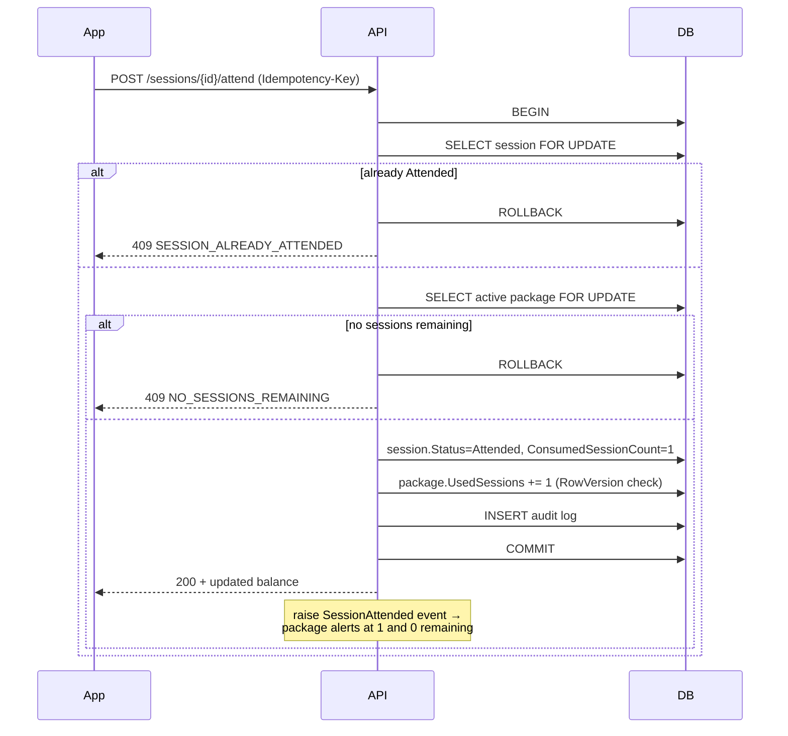

---

## 7. Authentication and Authorization

### 7.1 Invitation flow

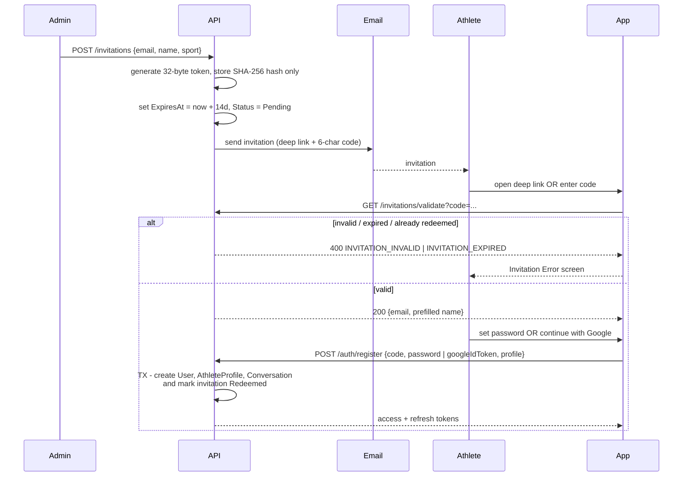

Design points:

- The raw code is **never stored** — only its hash, exactly like a password. A database leak does not yield usable invitations.
- Redemption and account creation are one transaction, satisfying *"a valid invitation creates exactly one athlete account."*
- The invitation carries the intended email; if the Google account's email differs, registration is rejected. This enforces *"each invitation can be used only for its intended athlete."*
- Both a deep link (convenience) and a short code (works when links break in email clients) are issued, matching the two screens in the catalogue.
- Rate-limited by IP and by code prefix to prevent brute-forcing.

### 7.2 Email/password

- ASP.NET Core Identity password hashing (PBKDF2 with high iteration count, or Argon2id if a well-maintained package is adopted).
- Minimum length 8, checked against a common-password list; no forced rotation or composition rules (modern NIST guidance — arbitrary complexity rules produce worse passwords).
- Account lockout: 5 failed attempts → 15-minute lockout, exponential on repeat.
- Login responses are constant-time and identical for "no such user" and "wrong password" to prevent account enumeration.

### 7.3 Google OAuth

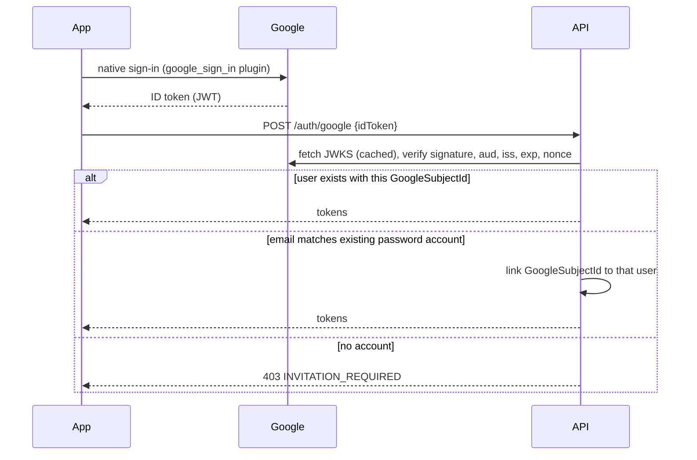

The last branch is the whole point: **Google sign-in is an authentication method, not a registration path.** BR-01 holds — no one enters the platform without an invitation.

### 7.4 JWT and refresh tokens

| Token | Lifetime | Storage | Contents |
|---|---|---|---|
| Access (JWT, HS256 or RS256) | 15 minutes | Memory + secure storage on device | `sub`, `role`, `coachId`, `athleteProfileId`, `jti`, `iat`, `exp` |
| Refresh (opaque, 256-bit random) | 30 days, sliding | Device secure storage (Keychain / Keystore) only | Hashed in DB with device ID, expiry, revocation flag |

**Rotation with reuse detection:** every refresh issues a new refresh token and marks the old one used. If a *used* token is presented again, the entire token family for that user is revoked and the user must log in again — the standard defence against a stolen refresh token.

Short access-token life plus a **paused-account middleware check** (below) means a paused athlete loses access within 15 minutes at worst.

### 7.5 Password reset

1. `POST /auth/forgot-password` — always returns `200`, regardless of whether the email exists (no enumeration).
2. A single-use token (hashed at rest, 1-hour expiry) is emailed as a deep link.
3. `POST /auth/reset-password` validates, sets the new hash, **revokes all refresh tokens** for that user, and writes an audit log.
4. A confirmation email is sent, so an unexpected reset is visible to the account owner.

### 7.6 Role authorization

Three layers, all required:

1. **Policy-based endpoint authorization** — `[Authorize(Policy = "AdminOnly")]` on every admin endpoint. Default policy is `RequireAuthenticatedUser`; endpoints are deny-by-default and must opt out explicitly to be anonymous.
2. **Resource ownership checks** — for any athlete-scoped resource, the handler asserts that the requesting athlete's `AthleteProfileId` matches the resource. An athlete requesting another athlete's package gets `404`, not `403` (do not confirm existence).
3. **Global query filters in EF Core** — athlete-scoped entities carry a filter on the current principal's athlete ID, so *forgetting* an ownership check still returns nothing. This is the structural backstop for the non-negotiable requirement "no athlete can access another athlete's information."

Permission matrix mapped to policies:

| Capability | Policy |
|---|---|
| View all athletes, invite, pause, delete | `AdminOnly` |
| Create package, mark attended, record payment/expense, assign to-do | `AdminOnly` |
| View own profile/package/sessions/to-dos | `SelfOrAdmin` (ownership-checked) |
| Complete to-do | `AthleteOwnerOnly` — explicitly excludes Admin, per the UI rule |
| Send chat message | `ConversationParticipant` |
| View reports | `AdminOnly` |

### 7.7 Paused athletes

Middleware executed after authentication on every authenticated request:

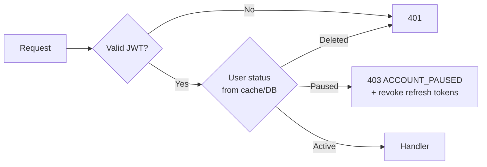

- On pause, the Admin's action **immediately revokes all refresh tokens and device tokens** for that athlete, so no new access token can be issued and pushes stop.
- The existing access token remains technically valid for up to 15 minutes, which the middleware check closes by consulting user status (cached in Redis for 60 seconds, invalidated on pause).
- The mobile app maps `ACCOUNT_PAUSED` to the Access Disabled screen and clears local state — satisfying *"a paused athlete receives an access-disabled message."*
- Paused data remains fully intact and visible to the Admin (BR-11).

---

## 8. Calendly Integration

### 8.1 Governing principle

Calendly is the **system of record for scheduling** (BR-13). The `Sessions` table is a **projection** of Calendly state, enriched with platform-only data (attendance, notes, package linkage) that Calendly knows nothing about.

This split is the key design decision:

| Owned by Calendly | Owned by the platform |
|---|---|
| Availability, event types | Attendance status |
| Booking creation | Package linkage and deduction |
| Rescheduling | Coach session notes |
| Cancellation | Delivery type classification (Online/F2F/Observation) |
| Invitee details, meeting links | Observations created outside Calendly |

The platform **never writes bookings to Calendly.** All mutations happen in Calendly's own UI; the platform reacts. This eliminates an entire class of two-way sync conflicts.

### 8.2 Booking flow

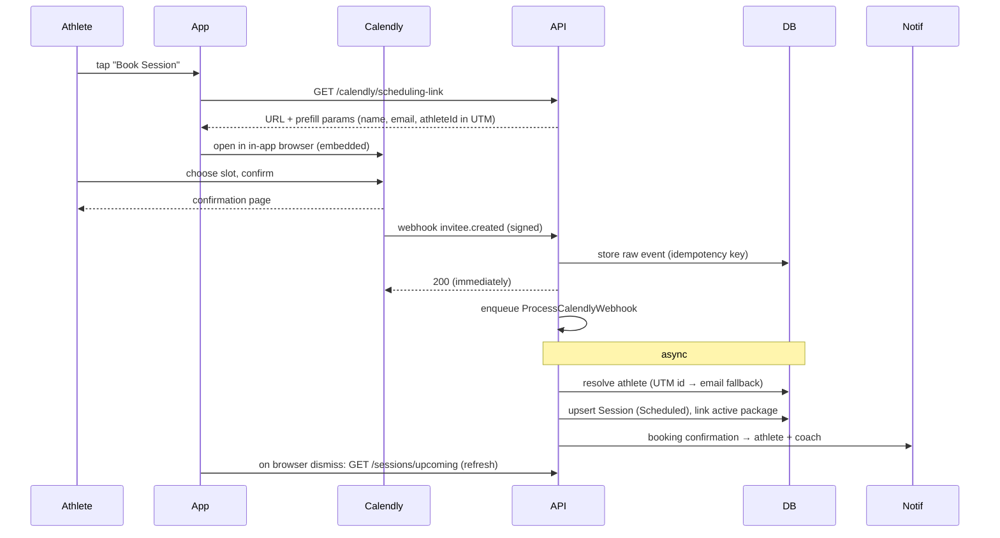

**Athlete resolution** is the fragile part and gets three strategies in order:
1. A signed athlete identifier passed as a Calendly UTM/tracking parameter on the scheduling link (primary — precise).
2. Invitee email matched to a user email (fallback).
3. Unresolved → session lands in an **Unmatched Bookings** queue visible to the Admin, who assigns it manually. Never silently dropped.

### 8.3 Webhooks

Subscribed events: `invitee.created`, `invitee.canceled`, and (where available) `invitee_no_show.created`. Rescheduling surfaces as a cancel + create pair carrying an `old_invitee` reference.

Receipt contract, in order:
1. **Verify the signature** using the Calendly signing key, with a timestamp tolerance window (replay protection). Invalid signature → `401`, logged at Error level.
2. **Persist the raw payload** to `CalendlyWebhookEvents` with a unique idempotency key derived from the event URI + type. A duplicate delivery hits the unique constraint and returns `200` without reprocessing.
3. **Return `200` within milliseconds.** Calendly retries non-2xx responses; slow processing causes duplicate deliveries.
4. **Enqueue** processing as a background job.

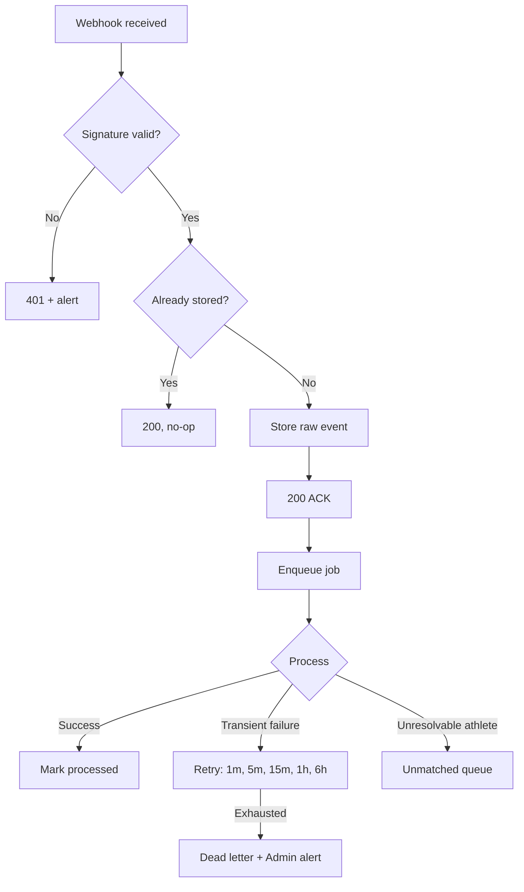

### 8.4 Reschedule

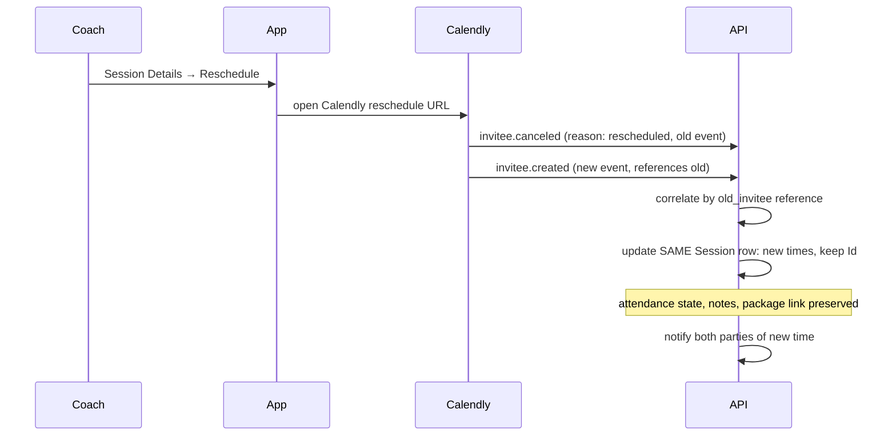

Correlating the pair and updating the same row (rather than cancelling one session and creating another) is what preserves coach notes and package linkage across a reschedule. If correlation fails, the fallback is cancel-plus-create, with notes migrated by a repair job.

### 8.5 Cancellation

- `invitee.canceled` → session `Status = Cancelled`, `CancelledAt`, reason stored.
- **No package deduction occurs or is reversed** — cancellation before attendance never touched the balance (BR-04, BR-06).
- If a session was already marked Attended and *then* cancelled in Calendly (an out-of-order edge case), the platform does **not** auto-reverse the deduction. It raises an Admin alert with a one-tap "Reverse attendance" action, which writes an audit entry. Automatic reversal of consumed value is too dangerous to do silently.
- Cancellation notifications go to both parties.

### 8.6 Reconciliation

Webhooks are best-effort delivery from a third party; the platform assumes some will be lost.

`ReconcileCalendlyEvents` runs every 15 minutes:
1. Fetch Calendly scheduled events for the window **[now − 7 days, now + 60 days]**.
2. Compare to local sessions by `CalendlyEventUri`.
3. **In Calendly, missing locally** → create the session.
4. **Locally Scheduled, cancelled in Calendly** → cancel locally.
5. **Time mismatch** → update local times.
6. **Locally exists, not in Calendly, and never attended** → flag for review (do not auto-delete; deleting a session the coach has written notes against is destructive).
7. Record a reconciliation summary; alert if drift exceeds a threshold, because persistent drift means webhooks are broken.

This job is also the **complete fallback path if webhooks are unavailable on the Calendly Standard plan** (A-01). In that case the interval tightens to 5 minutes and the product works with slightly higher sync latency. The architecture does not depend on the answer to that open question.

### 8.7 Failure handling and degradation

| Failure | Behaviour |
|---|---|
| Calendly API down when fetching the scheduling link | The link is cached per event type; the app opens the cached URL. Booking still works — it happens on Calendly's site. |
| Calendly's booking site down | The app shows a plain-language message with the coach's contact route (chat). Nothing else in the app is affected. |
| Webhook delivery failure | Reconciliation repairs within one cycle. |
| Webhook processing failure (transient) | Retried with backoff, then dead-lettered with an Admin alert and a manual replay action in the Hangfire dashboard. |
| Rate limited by Calendly (429) | Respect `Retry-After`; exponential backoff; reconciliation window narrows temporarily. |
| Signature key rotated | Support two active keys during rotation; verification tries both. |
| Calendly account suspended / plan changed | Reconciliation fails consistently → alert. Existing sessions and all non-scheduling features remain fully functional. |

**Circuit breaker** (Polly) on outbound Calendly calls: after repeated failures the circuit opens for 60 seconds and the app is told `CALENDLY_UNAVAILABLE` rather than hanging.

The critical property: **Calendly being unavailable degrades booking only.** Attendance, chat, packages, payments, to-dos, and reports all continue to work, because none of them call Calendly at request time.

---

## 9. Chat

### 9.1 Shape

One-to-one only, coach ↔ athlete, one permanent conversation per athlete (BR-16), created at account registration so no "start conversation" flow is needed.

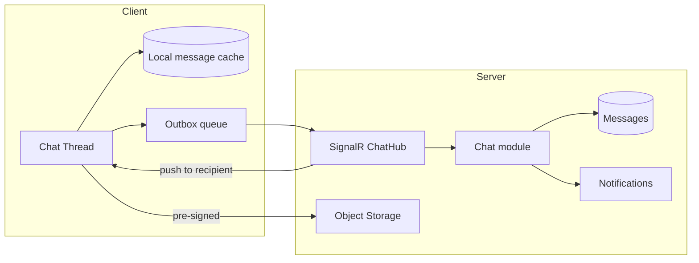

### 9.2 Transport

- **REST** for history (`GET /conversations/{id}/messages?before=cursor`) — cursor-paginated, 30 per page, cacheable, works on poor connections.
- **SignalR (WebSocket)** for live delivery, typing indicators (optional), and read receipts while the app is foregrounded, with automatic fallback to long-polling on restrictive networks.
- **FCM push** when the recipient has no active connection. The client never relies on the socket for eventual delivery — the socket is an optimisation, the database is the truth, and a reconnect always triggers a delta fetch.

Why not raw WebSockets: SignalR provides reconnection, transport fallback, and a Redis backplane for free — all things the team would otherwise hand-build.

### 9.3 Text messages

- Client generates a `ClientMessageId` (UUID) before sending; the server's unique index on `(ConversationId, ClientMessageId)` makes retries idempotent. This is what makes the offline outbox safe.
- Server stamps the authoritative `SentAt` — client clocks are not trusted for ordering.
- Content length capped (e.g. 4000 chars) and stored as text; no HTML rendering, so no injection surface.
- Editing and deletion are explicitly deferred (spec §4.7), so no soft-delete or edit-history machinery is built now — but `UpdatedAt` exists so adding it later is not a migration of the whole table.

### 9.4 Voice notes

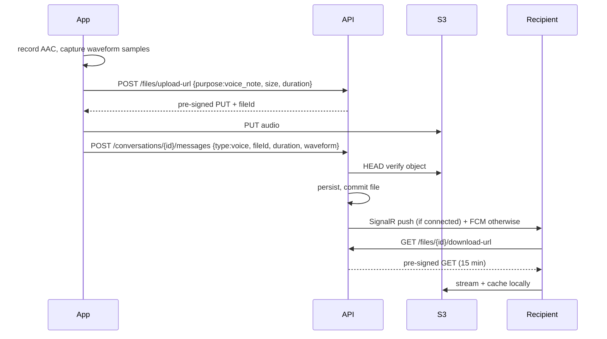

Waveform data travels with the message so the UI renders instantly without downloading audio — important on slow connections.

### 9.5 Images

Identical pipeline with `purpose: chat_image`, plus: client-side downscale, MIME allowlist (`image/jpeg`, `image/png`, `image/webp`), size cap (10 MB), server-side content-type verification via magic bytes (not the declared header), and a thumbnail generated by a background job for list previews. Gated behind a feature flag per A-09.

### 9.6 Storage layout

```
chat/{conversationId}/voice/{yyyy}/{MM}/{fileId}.m4a
chat/{conversationId}/images/{yyyy}/{MM}/{fileId}.jpg
chat/{conversationId}/images/{yyyy}/{MM}/{fileId}_thumb.jpg
```

Bucket is **private**; all access is via short-lived pre-signed URLs issued only after an ownership check. Date-partitioned keys keep listings manageable and make lifecycle rules straightforward.

### 9.7 Read status

- `Messages.DeliveredAt` set when the recipient's client acknowledges receipt over SignalR.
- `Messages.ReadAt` set when the thread is opened and the message is on screen.
- `Conversations.AdminUnreadCount` / `AthleteUnreadCount` are denormalised counters updated in the same transaction as the message insert and reset on read — so the conversation list and dashboard badge are a single indexed read, not an aggregate. This satisfies *"unread badges clear when the thread is opened."*

### 9.8 Push interaction

A message notification is only sent if the recipient has no live SignalR connection **and** the message is still unread after a short debounce (a few seconds). This avoids buzzing a phone that is already displaying the message, and collapses a rapid burst of messages into one notification.

### 9.9 Future scalability

The design already assumes the pieces that matter:

- Conversations are addressed by ID, not by "the coach" — adding coaches (section 17) requires no chat schema change.
- Messages are cursor-paginated and indexed by conversation, so table growth does not degrade reads; partitioning by month is available later without an application change.
- SignalR uses a Redis backplane as soon as there is more than one API instance.
- Group chat is out of scope, but `Conversations` has no two-participant constraint baked into the schema — adding a `ConversationParticipants` table is additive rather than a rewrite.
- Media lives in object storage from day one, so the database never becomes the bottleneck.

---

## 10. Notifications

### 10.1 Architecture

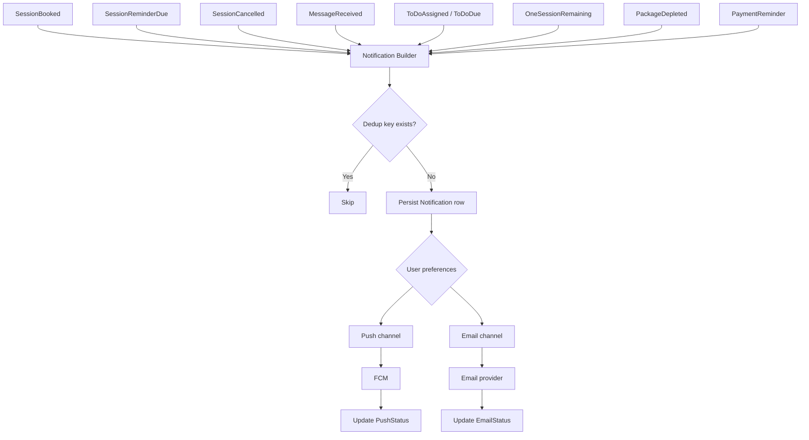

Every notification is **persisted first, delivered second.** The Notifications Centre reads from the database, so a failed push does not mean a lost notification — the user still sees it in-app.

### 10.2 Push notifications

- Firebase Cloud Messaging, one entry per device in `DeviceTokens` (A-13), registered at login and refreshed on token rotation.
- Payload carries `notificationId`, `type`, and `destinationRoute` so the app deep-links correctly (spec §4.10 acceptance criterion).
- Invalid/unregistered tokens returned by FCM are deleted immediately — stale tokens are the main source of push noise and cost.
- Content is deliberately minimal for chat: sender name and a short preview only, configurable to hide preview entirely, since coaching conversations are sensitive.

### 10.3 Email

Transactional templates, sent through the provider's template API:

| Template | Trigger |
|---|---|
| Athlete invitation | Admin creates invitation |
| Password reset | Reset requested |
| Password changed | Reset completed |
| Booking confirmation | `invitee.created` processed |
| Reschedule / cancellation | Corresponding Calendly event |
| Session reminder (24h) | Reminder scheduler |
| One session remaining | BR-08 |
| Package depleted / renew | BR-09 |
| Payment reminder | Admin action |

Provider webhooks (bounce, complaint, delivered) update `EmailStatus`, giving the logging required by *"push and email delivery are logged for troubleshooting."* Hard bounces flag the user's email as undeliverable and surface to the Admin — a bounced invitation is an onboarding blocker.

### 10.4 Session reminders

Hourly job scans sessions in the next 25 hours and enqueues reminders at T−24h and T−1h, keyed `session:{id}:reminder:{type}` for idempotency. Reminders are cancelled if the session is cancelled or rescheduled (rescheduling re-schedules them against the new time). Reminders respect the recipient's timezone (A-06) and are suppressed during a quiet-hours window unless the session itself falls in that window.

### 10.5 Package and to-do reminders

- **Package:** triggered by the `SessionAttended` domain event evaluating remaining balance — 1 remaining → "one session left"; 0 remaining → "renew". Deduped per `(packageId, alertType)` so re-attendance edits cannot re-notify. A daily safety sweep catches any package that reached a threshold without firing (e.g. from a manual data correction).
- **To-do:** on assignment, and on the daily overdue sweep when `DueDate` passes while Pending. Overdue notifications fire once, not daily, unless the Admin re-nudges.

### 10.6 Retry policy

| Channel | Retry schedule | Terminal handling |
|---|---|---|
| FCM | 3 attempts: 30s, 2m, 10m | Mark `PushStatus=Failed`; notification remains in-app; no user-visible error |
| Email | 5 attempts: 1m, 5m, 15m, 1h, 6h | Mark `EmailStatus=Failed`; alert Admin for invitations and password resets specifically, because those block the user |
| Webhook processing | 5 attempts, exponential | Dead-letter + Admin alert + manual replay |

Non-retryable errors (invalid token, hard bounce, malformed payload) fail fast without consuming the retry budget — distinguishing transient from permanent failures is what keeps the queue healthy.

---

## 11. File Storage

### 11.1 Provider and layout

S3-compatible private bucket (AWS S3 or Cloudflare R2). One bucket per environment.

```
profile-photos/{userId}/{fileId}.jpg
profile-photos/{userId}/{fileId}_thumb.jpg
chat/{conversationId}/voice/{yyyy}/{MM}/{fileId}.m4a
chat/{conversationId}/images/{yyyy}/{MM}/{fileId}.jpg
receipts/{coachId}/{yyyy}/{fileId}.{ext}
```

### 11.2 Access model

**No object is ever public.** Every read and write goes through a pre-signed URL issued by the API after an authorization check.

| Operation | TTL | Check performed before issuing |
|---|---|---|
| Upload (PUT) | 5 min | Purpose is valid for the caller's role; declared size within cap; content type in allowlist |
| Download (GET) | 15 min | Caller owns the resource or is a conversation participant |

Two-phase commit for uploads (`Pending` → `Committed`) prevents orphaned objects and prevents a client from claiming a file it never uploaded — the API verifies the object exists and matches the declared size before linking it to a message or profile.

### 11.3 Per-purpose rules

| Purpose | Max size | Types | Processing | Retention |
|---|---|---|---|---|
| Profile photo | 5 MB | jpeg, png, webp | Downscale client-side; server generates thumbnail | Replaced on change; old object deleted |
| Voice note | 10 MB / 5 min | m4a, aac | None (waveform computed client-side) | Lifetime of the message |
| Chat image | 10 MB | jpeg, png, webp | Thumbnail job | Lifetime of the message |
| Expense receipt | 10 MB | jpeg, png, pdf | None | Lifetime of the expense record |

### 11.4 Operational concerns

- **Encryption at rest** enabled at the bucket level; **TLS** for all transfer.
- **Versioning off, lifecycle rules on**: incomplete multipart uploads aborted after 1 day; orphaned `Pending` file records and their objects swept nightly.
- **Client caching:** downloaded voice notes and images cached on-device with an LRU cap, so playback and re-viewing cost nothing.
- **Deletion:** when an athlete is deleted/anonymized (A-07), all objects under their conversation and profile prefixes are deleted, and the deletion is audit-logged.
- **CDN:** not required for v1 (private, low-volume, per-object signed access). If voice-note playback latency becomes an issue, a signed-URL-compatible CDN (CloudFront / Cloudflare) sits in front without an application change.
- **Future attachments** (session documents, exported reports) fit the same model by adding a `Purpose` value and a prefix — no new infrastructure.

---

## 12. Security

### 12.1 Authentication

Covered in section 7. Summary of the controls that matter most: hashed invitation codes, no public registration path, short-lived access tokens, rotating refresh tokens with reuse detection, lockout on repeated failures, no account enumeration on login or password reset, Google ID tokens verified server-side against cached JWKS (never trusting a client-asserted identity).

### 12.2 Authorization

Deny-by-default endpoints; role policies; per-resource ownership checks; EF Core global query filters as a structural backstop. The single most important requirement in the whole document — *no athlete may see another athlete's data* — is defended at three independent layers, so any one of them failing is not a breach.

### 12.3 Encryption

- **In transit:** TLS 1.2+ enforced end to end; HSTS on the API; certificate pinning considered for the mobile client (weighed against the operational risk of pinning a rotating certificate — recommended only if the team can manage rotation reliably).
- **At rest:** managed database encryption; bucket-level object encryption; secrets encrypted in the secret store.
- **Application-level:** password hashes (PBKDF2/Argon2id), invitation codes, refresh tokens, and password-reset tokens are all stored as SHA-256/one-way hashes — never recoverable.

### 12.4 Secrets management

- Cloud secret store per environment; injected as environment variables at container start.
- Nothing secret in Git, in the image, or in client-side code. The mobile app ships with no API secret — the Google client ID is public by design, and the Calendly token lives only on the server.
- Rotation procedure documented for: JWT signing key (dual-key overlap), Calendly signing key, FCM credentials, database password, storage keys.
- CI secrets stored as repository/environment secrets with least-privilege deploy credentials.

### 12.5 Rate limiting

ASP.NET Core rate limiting middleware plus Redis counters:

| Endpoint group | Limit |
|---|---|
| `POST /auth/login` | 5 per 15 min per IP + per email |
| `POST /auth/forgot-password` | 3 per hour per email |
| `GET /invitations/validate` | 10 per hour per IP |
| `POST /files/upload-url` | 30 per hour per user |
| Chat message send | 60 per minute per user |
| General authenticated API | 300 per minute per user |
| Calendly webhook | not rate limited; signature-gated instead |

### 12.6 Input validation

Every request validated at the edge (FluentValidation) before reaching a handler; parameterised queries only (EF Core/Dapper — no string-concatenated SQL); MIME and magic-byte verification on uploads; URL validation with an HTTPS-only scheme allowlist on whiteboard links to prevent `javascript:` and similar; message content stored and rendered as plain text.

### 12.7 OWASP Mobile and API Top 10 mapping

| Risk | Mitigation |
|---|---|
| Broken object level authorization (API1) | Ownership checks + global query filters; `404` not `403` on foreign resources |
| Broken authentication (API2) | Short tokens, rotation with reuse detection, lockout, no enumeration |
| Broken object property level authorization (API3) | Explicit DTOs — entities are never serialised directly; no mass assignment |
| Unrestricted resource consumption (API4) | Rate limits, size caps, pagination limits, upload quotas |
| Broken function level authorization (API5) | Deny-by-default policies, admin endpoints on separate policy |
| Unrestricted access to sensitive business flows (API6) | Invitation-only; idempotency on attendance and payments |
| SSRF (API7) | No user-supplied URL is fetched server-side; whiteboard links are stored and opened client-side only |
| Security misconfiguration (API8) | Hardened headers, no stack traces, environment-separated config, dependency scanning in CI |
| Improper inventory management (API9) | Versioned API, documented endpoints, staging isolated from production data |
| Insecure data storage (Mobile M2) | Tokens in Keychain/Keystore only; no sensitive data in shared preferences or logs; screenshot suppression considered on chat |
| Insufficient cryptography (Mobile M5) | Platform crypto only; no custom schemes |

### 12.8 Audit logs

Append-only `AuditLogs` for every action with legal, financial, or access significance:

- Athlete created, edited, paused, reactivated, deleted, anonymized
- Package created, closed, renewed
- **Session marked attended / attendance reversed** (with before/after balance)
- Payment status changed or payment confirmed
- Expense created, edited, deleted
- Invitation created, redeemed, revoked
- Role or permission change, password reset completed
- Bulk data export

Each row carries actor, action, entity, before/after state, correlation ID, IP, and timestamp. The application database role has `INSERT` only on this table — no `UPDATE`, no `DELETE`. Retention outlives normal log retention.

### 12.9 Privacy

Data minimisation (only fields the spec requires); a privacy policy and consent text before launch; deletion is logged and irreversible; chat content is excluded from logs and analytics; an Admin-triggered athlete data export is available to support subject-access requests.

---

## 13. Performance

### 13.1 Realistic load profile

One coach, an estimated 20–60 active athletes, a few sessions per day, and chat volume in the low hundreds of messages per day. **This system's performance risk is not throughput — it is bad queries and chatty screens.** The measures below are proportionate to that.

### 13.2 Caching

| Cached | Store | TTL | Invalidation |
|---|---|---|---|
| Admin dashboard aggregates per period | Redis | 5 min | On session attendance, payment, expense write |
| User status (Active/Paused) for the auth middleware | Redis | 60 s | Explicit on pause/reactivate |
| Calendly scheduling link | Redis | 1 h | Manual refresh action |
| Athlete list first page | Redis | 2 min | On athlete create/edit/pause |
| Static config / feature flags | In-memory | 5 min | On write |

Deliberately **not** cached: package balances, session attendance state, payment status. These must be read-your-writes correct; a stale balance is a support ticket.

### 13.3 Pagination

- Cursor-based (keyset) pagination for messages, sessions, notifications, and audit logs — stable under insertion and fast at depth, unlike `OFFSET`.
- Offset pagination acceptable only for the athlete list, which is small and needs jump-to-page semantics.
- Hard page-size cap of 100; default 20–30.
- No unbounded list endpoint exists anywhere in the API.

### 13.4 Indexes

See section 6.5. The four indexes that carry the product: `Sessions(CoachId, ScheduledStartUtc, Status)` for dashboard and schedule; `Messages(ConversationId, SentAt DESC)` for chat; the partial unique on active packages for correctness; and the trigram index on athlete names for search.

### 13.5 Query discipline

- EF Core `AsNoTracking()` on all reads; explicit `Include` with projection to DTOs so no query returns whole entity graphs.
- N+1 detection: integration tests assert query counts on the dashboard and athlete list endpoints — the two places where N+1 is most likely and most damaging.
- Dashboard aggregates are a single hand-written SQL query via Dapper, computing all period KPIs in one round trip rather than six.
- Slow-query logging enabled at 200 ms.

### 13.6 Scalability path

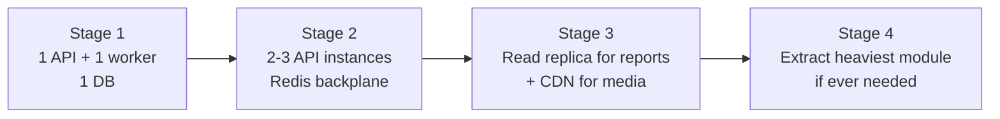

The API is stateless (no in-process session state, no in-memory job queue), so stage 1 → 2 is a configuration change plus adding the Redis backplane for SignalR. Nothing in the design blocks horizontal scaling.

### 13.7 Expected bottlenecks

| Bottleneck | When it appears | Mitigation |
|---|---|---|
| Dashboard aggregate query | Immediately, if written naively in EF | Single Dapper query + cache |
| Last-session-note lookup per upcoming session card | Immediately, if written naively | Lateral join in the same dashboard query; note truncated server-side |
| Calendly API rate limits | Reconciliation over a wide window, or many athletes | Narrow window, backoff, respect `Retry-After` |
| Chat history growth | Years of use | Cursor pagination now; monthly partitioning later |
| FCM fan-out | Never at this scale | Batched sends already supported by the SDK |
| Media bandwidth through the API | Would appear if uploads were proxied | Avoided by design — direct-to-storage |
| Cold starts on scale-to-zero hosting | If a consumption plan is chosen | Set minimum instances to 1 |
| Background job contention | Reconciliation overlapping with reminders | Distinct queues and staggered schedules |

---

## 14. API Design

Base: `/api/v1`. All endpoints authenticated unless marked **(anon)**. `A` = Admin only, `T` = Athlete only, `B` = Both (ownership-scoped).

### 14.1 Authentication and invitations

| Method | Path | Role | Purpose |
|---|---|---|---|
| POST | `/auth/login` | anon | Email/password sign-in |
| POST | `/auth/google` | anon | Google ID-token sign-in |
| POST | `/auth/register` | anon | Redeem invitation and create account |
| POST | `/auth/refresh` | anon | Rotate refresh token |
| POST | `/auth/logout` | B | Revoke current refresh token |
| POST | `/auth/forgot-password` | anon | Request reset email |
| POST | `/auth/reset-password` | anon | Complete reset |
| POST | `/auth/change-password` | B | Change while signed in |
| GET | `/auth/me` | B | Current user, role, status |
| GET | `/invitations/validate` | anon | Validate code/link |
| POST | `/invitations` | A | Create invitation |
| GET | `/invitations` | A | List invitations |
| POST | `/invitations/{id}/resend` | A | Resend email |
| DELETE | `/invitations/{id}` | A | Revoke |

### 14.2 Athletes

| Method | Path | Role | Purpose |
|---|---|---|---|
| GET | `/athletes` | A | List with search, filter (all/active/inactive), sort, paging |
| GET | `/athletes/{id}` | A | Full athlete profile |
| POST | `/athletes` | A | Create athlete record (paired with invitation) |
| PATCH | `/athletes/{id}` | A | Edit details |
| POST | `/athletes/{id}/pause` | A | Pause access |
| POST | `/athletes/{id}/reactivate` | A | Restore access |
| DELETE | `/athletes/{id}` | A | Delete/anonymize (confirmation required) |
| GET | `/athletes/{id}/summary` | A | Profile-screen aggregate: package, payment, to-dos |
| GET | `/athletes/{id}/history` | A | Session history |
| GET | `/athletes/{id}/export` | A | Data export |

### 14.3 Packages

| Method | Path | Role | Purpose |
|---|---|---|---|
| GET | `/athletes/{id}/packages` | B | Package history |
| GET | `/athletes/{id}/packages/active` | B | Current package + balance |
| POST | `/athletes/{id}/packages` | A | Create/renew package |
| GET | `/packages/{id}` | B | Package details |
| PATCH | `/packages/{id}` | A | Edit price, notes, dates |
| POST | `/packages/{id}/close` | A | Close package |
| GET | `/me/package` | T | Athlete's own active package |

### 14.4 Scheduling and sessions

| Method | Path | Role | Purpose |
|---|---|---|---|
| GET | `/calendly/scheduling-link` | T | URL to open for booking |
| GET | `/sessions` | B | List by date range, athlete, status |
| GET | `/sessions/upcoming` | B | Next N sessions |
| GET | `/sessions/{id}` | B | Session details |
| POST | `/sessions/observations` | A | Create an observation session (A-03) |
| POST | `/sessions/{id}/attend` | A | Mark attended — idempotent, deducts once |
| POST | `/sessions/{id}/no-show` | A | Mark no-show |
| POST | `/sessions/{id}/reverse-attendance` | A | Correct a mistaken attendance (audited) |
| PATCH | `/sessions/{id}` | A | Edit duration, delivery type, location |
| GET | `/sessions/{id}/reschedule-link` | B | Calendly reschedule URL |
| GET | `/sessions/{id}/cancel-link` | B | Calendly cancellation URL |
| GET | `/sessions/{id}/notes` | A | Coach session notes |
| PUT | `/sessions/{id}/notes` | A | Create/update notes |
| GET | `/sessions/unmatched` | A | Bookings needing athlete assignment |
| POST | `/sessions/unmatched/{id}/assign` | A | Assign to athlete |
| POST | `/webhooks/calendly` | anon (signed) | Calendly webhook receiver |

### 14.5 Chat

| Method | Path | Role | Purpose |
|---|---|---|---|
| GET | `/conversations` | A | Conversation list with unread counts |
| GET | `/conversations/{id}` | B | Conversation metadata |
| GET | `/me/conversation` | T | Athlete's single conversation |
| GET | `/conversations/{id}/messages` | B | Cursor-paginated history |
| POST | `/conversations/{id}/messages` | B | Send text/voice/image |
| POST | `/conversations/{id}/read` | B | Mark thread read |
| WS | `/hubs/chat` | B | SignalR real-time channel |

### 14.6 To-dos

| Method | Path | Role | Purpose |
|---|---|---|---|
| GET | `/todos` | B | List, filtered by status/priority/due |
| POST | `/todos` | A | Assign to-do |
| GET | `/todos/{id}` | B | Details |
| PATCH | `/todos/{id}` | A | Edit |
| POST | `/todos/{id}/complete` | T | Athlete marks complete |
| POST | `/todos/{id}/reopen` | A | Reopen |
| POST | `/todos/{id}/archive` | A | Archive |

### 14.7 Payments and expenses

| Method | Path | Role | Purpose |
|---|---|---|---|
| GET | `/payments` | A | Payment list with filters |
| POST | `/packages/{id}/payments` | A | Record confirmed payment |
| PATCH | `/packages/{id}/payment-status` | A | Set Unpaid/Partial/Paid |
| GET | `/payments/instapay-instructions` | B | Configured InstaPay destination/instructions |
| GET | `/expenses` | A | Expense list |
| POST | `/expenses` | A | Add expense |
| PATCH | `/expenses/{id}` | A | Edit |
| DELETE | `/expenses/{id}` | A | Delete |

### 14.8 Notifications, dashboards, reports, files, settings

| Method | Path | Role | Purpose |
|---|---|---|---|
| GET | `/notifications` | B | Notification centre, paginated |
| POST | `/notifications/{id}/read` | B | Mark read |
| POST | `/notifications/read-all` | B | Mark all read |
| GET | `/notifications/preferences` | B | Preferences |
| PUT | `/notifications/preferences` | B | Update preferences |
| POST | `/devices` | B | Register push token |
| DELETE | `/devices/{token}` | B | Unregister |
| GET | `/dashboard/admin` | A | KPIs for period + alerts + upcoming |
| GET | `/dashboard/athlete` | T | Package, next session, to-dos, unread |
| GET | `/reports/sessions` | A | Attended, hours, delivery breakdown |
| GET | `/reports/financial` | A | Paid/unpaid counts, expenses |
| GET | `/reports/packages` | A | Athletes near completion |
| POST | `/files/upload-url` | B | Issue pre-signed PUT |
| GET | `/files/{id}/download-url` | B | Issue pre-signed GET |
| GET | `/athletes/{id}/whiteboard-links` | B | Links for athlete |
| PUT | `/athletes/{id}/whiteboard-links` | A | Set/update links |
| GET | `/me/profile` | B | Own profile |
| PATCH | `/me/profile` | B | Update allowed fields |
| GET | `/settings` | A | System settings / flags |
| PATCH | `/settings` | A | Update settings |
| GET | `/health` | anon | Liveness/readiness |

### 14.9 Cross-cutting API conventions

- **Idempotency:** `Idempotency-Key` header honoured on `POST /sessions/{id}/attend`, payment creation, and message send.
- **Errors:** RFC 7807 Problem Details + `errorCode` + `correlationId`.
- **Pagination:** `?cursor=&limit=` for streams; `?page=&pageSize=` for the athlete list; responses carry `nextCursor` / `totalCount`.
- **Filtering:** consistent query parameter names across list endpoints (`from`, `to`, `status`, `search`, `sort`).
- **Versioning:** URL path (`/api/v1`) — simplest to reason about for mobile clients that cannot be force-updated instantly.
- **Minimum supported app version** returned on `/auth/me`, enabling a forced-upgrade path when a breaking change lands.

---

## 15. Folder Structure

### 15.1 Repository layout

A **monorepo**. With three developers and a backend/mobile pair that changes together, a single repository keeps contract changes atomic and CI simple.

```
mental-coaching/
├── README.md
├── docs/
│   ├── architecture.md              # this document
│   ├── adr/                         # architecture decision records
│   ├── api/openapi.yaml             # generated, committed
│   └── runbooks/                    # incident procedures
├── backend/
│   ├── MentalCoaching.sln
│   ├── src/                         # see section 5.3
│   ├── tests/
│   ├── Dockerfile
│   └── docker-compose.yml           # postgres + redis + minio for local dev
├── mobile/
│   ├── lib/                         # see section 4.3
│   ├── test/
│   ├── integration_test/
│   ├── android/ ios/
│   └── pubspec.yaml
├── infra/
│   ├── terraform/                   # or bicep — environments as code
│   └── scripts/
└── .github/workflows/
    ├── backend-ci.yml
    ├── mobile-ci.yml
    └── deploy.yml
```

### 15.2 Why this shape

- `docs/adr/` matters more than it looks: with three developers over a long build, "why did we do it this way" is the most expensive question to answer later. Each significant decision in this document becomes an ADR.
- `openapi.yaml` is generated from the backend and committed, so the mobile developer sees contract changes in code review rather than at runtime.
- `docker-compose.yml` with Postgres, Redis, and MinIO means a new developer runs one command and has a complete local environment including object storage.
- `infra/` as code prevents environments from drifting apart, which is the usual cause of "works in staging".

---

## 16. Deployment

### 16.1 Environments

| | Development | Staging | Production |
|---|---|---|---|
| Backend | Local Docker Compose | 1 small container instance | 1–2 instances + 1 worker |
| Database | Local Postgres container | Managed Postgres, smallest tier | Managed Postgres, daily backups + PITR |
| Redis | Local container | Managed, small | Managed, small |
| Storage | MinIO container | Dedicated bucket | Dedicated bucket |
| Calendly | Sandbox/test event type | Separate test event type | Live coach account |
| FCM | Dev Firebase project | Staging project | Production project |
| Email | Provider sandbox / MailHog | Provider test mode | Live, verified domain (SPF/DKIM/DMARC) |
| Mobile | Debug flavour | TestFlight / Play Internal | App Store / Play Store |
| Data | Seeded synthetic | **Synthetic only — never production data** | Real |

### 16.2 Hosting recommendation

**Azure Container Apps** (primary recommendation) or AWS ECS Fargate / DigitalOcean App Platform. All run the same container image; the choice is a cost and familiarity decision, not an architectural one.

- **Database:** managed PostgreSQL (Azure Database for PostgreSQL Flexible Server / AWS RDS / DO Managed DB), automated daily backups, point-in-time recovery, private networking only.
- **Storage:** S3 or Cloudflare R2 (R2 preferred if voice-note playback volume is significant, due to zero egress cost).
- **CDN:** not required for v1 (section 11.4); the seam exists if needed.
- **TLS:** managed certificates at the platform edge.

### 16.3 Configuration and environment variables

Injected from the secret store; never committed. Grouped by concern:

```
ASPNETCORE_ENVIRONMENT
ConnectionStrings__Postgres
ConnectionStrings__Redis
Jwt__Issuer / Jwt__Audience / Jwt__SigningKey / Jwt__AccessTokenMinutes
Google__ClientId__Android / __iOS / __Web
Calendly__ApiToken / Calendly__WebhookSigningKey / Calendly__OrganizationUri / Calendly__EventTypeUri
Storage__Endpoint / __Bucket / __AccessKey / __SecretKey / __Region
Fcm__ServiceAccountJson
Email__Provider / Email__ApiKey / Email__FromAddress
App__PublicBaseUrl / App__DeepLinkScheme
Features__ChatImagesEnabled / Features__NoShowDeducts
Observability__ConnectionString / Sentry__Dsn
```

Options are validated at startup (`ValidateOnStart`), so a misconfigured environment fails the deployment health check instead of failing silently in production.

### 16.4 Pipeline

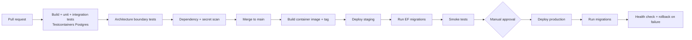

**Migration policy:** migrations run as a separate step before the new revision receives traffic, and must be **backward compatible** — additive changes first, destructive changes only after the previous version is fully retired. This allows rolling deploys with no downtime and a safe rollback.

**Mobile releases** ship independently on their own cadence. Because users cannot be forced to update instantly, the API supports the previous mobile version for at least one release cycle, with `minimumSupportedVersion` driving a soft or hard upgrade prompt.

### 16.5 Operational readiness

- `/health` (liveness) and `/health/ready` (dependency checks: DB, Redis, storage) wired to platform probes.
- Uptime monitoring with alerting to the team.
- Alerts on: error rate spike, Calendly reconciliation failures, webhook dead-letters, job queue depth, database connection saturation, failed invitation or reset emails.
- Documented runbooks for the three most likely incidents: Calendly desync, push notifications not arriving, and a stuck background job.
- Backup **restore** tested before launch. An untested backup is not a backup.

---

## 17. Future Scalability

The specification names the v2+ roadmap explicitly. Each item below states what the architecture already does today to make it cheap, and what would actually have to change.

### 17.1 Multiple coaches

**Already done:** `CoachId` exists on every owned entity from day one; conversations are addressed by ID rather than by "the coach"; authorization is policy-based rather than "is admin".

**Would change:** relax "one Admin" to a Coach role with a coach-scoped query filter (the same mechanism already protecting athletes); each coach gets their own Calendly connection, so `CalendlyConnections` moves from a settings row to a table keyed by coach; the dashboard scopes by `CoachId`.

This is the single highest-value investment in this document, and it costs almost nothing now.

### 17.2 Organizations / teams

Adds a tenant layer above coaches: an `Organizations` table, `OrganizationId` on users, and a global filter one level up. Because tenancy is already enforced structurally by query filters rather than by scattered `WHERE` clauses, this is a schema addition plus a filter change — not a rewrite. Group chat and group sessions would additionally require the `ConversationParticipants` table anticipated in section 9.9.

### 17.3 Video calls

Sessions already carry `DeliveryType` and `MeetingUrl`. Adding a provider (Daily.co, Twilio Video, 100ms) means a new `VideoRooms` module that creates a room per session and returns a join token — the session model itself does not change. Recording, if ever wanted, reuses the existing object-storage pipeline.

### 17.4 AI summaries

The prerequisite data already exists: session notes, chat history, to-do completion, and package progression are all stored as structured records. An `Insights` module would consume domain events, call an LLM provider asynchronously via the existing background job infrastructure, and store generated summaries in a new table linked to sessions or athletes. Nothing about the current design blocks it. The real work is consent and privacy policy, not architecture.

### 17.5 Custom booking engine

This is the largest future change, and the projection design is what makes it survivable. Because the app already reads scheduling data from its own `Sessions` table rather than from Calendly, replacing Calendly means:
1. Building `Availability` and `BookingRules` inside the Scheduling module.
2. Switching the session source from the Calendly adapter to the internal engine behind the same interface.
3. Migrating historical events.

The UI, the attendance flow, the reminders, and the reports do not change at all — they never knew Calendly existed.

### 17.6 Wearables, journals, mood tracking

All three are the same architectural shape: a new module owning its own tables, writing time-series-ish records linked to an athlete, feeding the existing reporting layer. Wearables additionally need an OAuth connection per athlete (Apple Health / Google Fit / Garmin) and a periodic sync job — both patterns already exist in the codebase (Google OAuth, Calendly reconciliation), so they are copies of solved problems rather than new ones.

### 17.7 What would force a genuine re-architecture

Being honest about the limits: this design would need real rework if the product moved to **thousands of concurrent coaches with heavy real-time usage** (chat would want extraction and a dedicated message store), or if **strict data residency across multiple countries** were required (multi-region deployment and per-region databases). Neither is on the stated roadmap, and designing for them now would be a costly mistake.

---

## 18. Risks

| # | Risk | Likelihood | Impact | Mitigation |
|---|---|---|---|---|
| R-01 | **Calendly Standard may not include webhooks** (A-01) | Medium | High — the primary sync mechanism | Reconciliation polling built regardless; verify entitlement in week 1; budget for a plan upgrade |
| R-02 | **Double session deduction** breaks the core business promise | Medium without controls | Critical — financial dispute with athletes | Row-level locking, optimistic concurrency, `ConsumedSessionCount`, check constraints, idempotency key, unit + integration tests specifically for this path |
| R-03 | **Calendly outage or account issue** blocks booking | Low–Medium | Medium | Circuit breaker, cached links, graceful degradation; everything except booking keeps working |
| R-04 | **Manual payment confirmation** creates disputes ("I paid, it says unpaid") | Medium | Medium | Every status change audit-logged with actor, timestamp, and note; payment history visible to the athlete; reminder notifications |
| R-05 | **Invitation email lands in spam** — blocks all onboarding | Medium | High | Reputable transactional provider, verified domain with SPF/DKIM/DMARC, bounce/complaint webhooks, short backup code the coach can read out over the phone |
| R-06 | **Athlete resolution fails** on a Calendly booking (email mismatch) | Medium | Medium | Signed identifier in the scheduling link; email fallback; Unmatched Bookings queue rather than silent loss |
| R-07 | **Single points of failure** — one database, one region | Low | High | Managed DB with automated backups and PITR; tested restore procedure; documented RTO/RPO |
| R-08 | **Scope creep from "future" items** into v1 | High | High | Everything in section 17 is explicitly deferred; assumptions table forces decisions to be surfaced rather than absorbed |
| R-09 | **Modular monolith degrades into a tangle** under deadline pressure | Medium | Medium–High (long term) | Automated architecture tests fail the build on cross-module references; ADRs record boundaries |
| R-10 | **Mobile store review delays** at release | Medium | Medium | Submit a build to both stores early in the project to flush out account/metadata issues; server-side feature flags reduce dependence on new binaries |
| R-11 | **Timezone errors** in reports and reminders (A-06) | Medium | Medium | UTC storage everywhere, `IClock` abstraction, explicit timezone tests at DST and month boundaries |
| R-12 | **Sensitive data exposure** — coaching notes and chat are highly personal | Low with controls | Critical (trust, legal) | Three-layer authorization, no public storage objects, chat excluded from logs, audit trail, encryption in transit and at rest |
| R-13 | **Key-person dependency** on a 3-person team | Medium | Medium | Monorepo, ADRs, runbooks, generated API docs, no undocumented manual deployment steps |
| R-14 | **Push notification unreliability** (token churn, OEM battery managers on Android) | High | Low–Medium | Notifications persisted server-side and always visible in-app; email as a secondary channel for important events; invalid tokens pruned |
| R-15 | **Under-specified observation flow** (A-03) delays the attendance feature | Medium | Medium | Flagged as a blocking assumption requiring a client decision before the Scheduling module is built |
| R-16 | **Four UI screens are unwritten** (Chat, Packages, Payments, Settings marked "To be completed") | Certain | Medium | Those modules are designed from the specification's functional requirements; screen-level review scheduled before phases 4–5 of the build order |
| R-17 | **Document conflicts resolved by assumption rather than by the client** (C-01…C-07) | High | Medium | All seven listed explicitly in section 0.3 with the implemented side stated; C-01 and C-02 need a ruling before Packages and Scheduling are built |

---

## 19. Final Recommendation

### 19.1 The architecture in one paragraph

A Flutter mobile client for both roles, talking to a single ASP.NET Core modular monolith over REST plus one WebSocket channel, backed by PostgreSQL and Redis, with files in S3-compatible object storage, scheduling projected from Calendly and repaired by reconciliation, notifications delivered asynchronously through FCM and a transactional email provider, and every business-critical invariant enforced at the database level rather than by convention.

### 19.2 Why it fits *this* product

**It matches the team.** Three developers can build, deploy, debug, and operate one backend service and one mobile app. They could not operate eight services, two languages, and a message broker — and nothing about this product requires them to.

**It matches the scale.** One coach and a few dozen athletes is a workload a single modest instance handles with enormous headroom. The architecture spends its complexity budget on correctness and maintainability, not on throughput the product will never need.

**It protects what actually matters.** The specification's most important rules — invitation-only access, one active package, exactly-once deduction, no cross-athlete data access — are all enforced structurally: partial unique indexes, check constraints, optimistic concurrency, global query filters, and deny-by-default authorization. These do not rely on a developer remembering a rule two years from now.

**It contains the external dependency.** Calendly is the one part of this system nobody on the team controls. Treating local sessions as a projection, reconciling continuously, and never calling Calendly on a request path means a Calendly problem degrades exactly one feature instead of taking the product down.

**It leaves the right doors open.** `CoachId` everywhere, module boundaries enforced by tests, scheduling behind an interface, media already in object storage — the roadmap items in section 17 are additive work, not rewrites. In particular, the multi-coach future costs almost nothing today.

**It avoids what it does not need.** No microservices, no Kubernetes, no GraphQL, no event bus, no offline-first sync engine, no payment gateway integration. Each of those would be defensible in a larger system and would be a mistake here.

### 19.3 What must be decided before development starts

1. **A-01** — Confirm Calendly webhook entitlement on the purchased plan.
2. **A-03** — Define how observations are created and when they deduct.
3. **A-02** — Confirm the source of session duration for hour reporting.
4. **A-07** — Confirm deletion vs anonymization semantics with the client's privacy requirements.
5. **A-12** — Confirm hosting region and any data residency requirement.
6. **C-01** — Rule on payment statuses: three values (spec) or two (UI doc). This determines whether partial payments exist at all.
7. **C-02** — Rule on the **New Session** quick action: is it Observation creation, manual booking, or removed?

Items 1 and 3 block the Scheduling module. Item 2 and C-02 block the attendance flow; C-01 blocks the Packages module. The others can be resolved in parallel with early development but should not reach implementation undecided.

### 19.4 Suggested build order

```mermaid
graph LR
    P1[Phase 1<br/>Auth, invitations,<br/>athletes, profiles] --> P2[Phase 2<br/>Packages,<br/>attendance]
    P2 --> P3[Phase 3<br/>Calendly sync,<br/>schedule, sessions]
    P3 --> P4[Phase 4<br/>Chat, voice notes,<br/>notifications]
    P4 --> P5[Phase 5<br/>To-dos, payments,<br/>expenses]
    P5 --> P6[Phase 6<br/>Dashboards,<br/>reports, polish]
```

The order is deliberate: identity and athletes unlock everything else; packages and attendance are the hardest correctness problem and should be built while the team is fresh and the schedule has slack; Calendly is the biggest unknown and should be de-risked third, not last; dashboards and reports come last because they are read-only projections of everything before them and cannot be built accurately until the underlying records exist.

---

*End of architecture document.*
